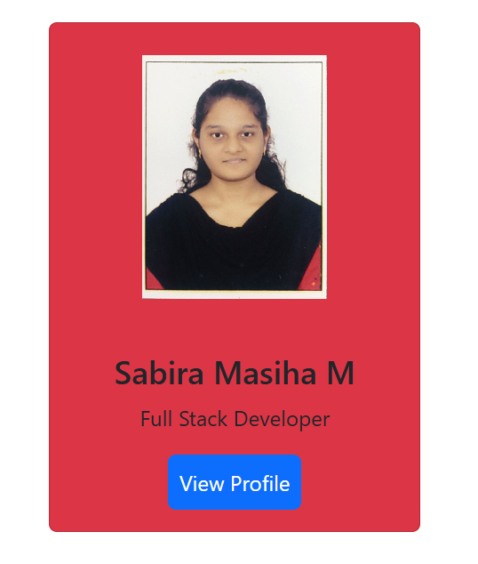

# Day 01 - Bootstrap Basics

## Overview

Started learning Bootstrap by creating a simple Student Profile Card using Bootstrap classes and components.

The task focused on understanding Bootstrap's container, card, image, spacing, alignment, color, and button utilities.

## Topics Covered

- Bootstrap CDN
- Container
- Card Component
- Image Utilities
- Width Utilities
- Spacing Utilities
- Text Alignment
- Background Colors
- Buttons
- Basic Layout

## Technologies Used

- HTML5
- Bootstrap 5.3.3

## Practice

Created a Student Profile Card containing:

- Profile image
- Student name
- Role
- View Profile button

## Bootstrap Classes Used

- `container`
- `mt-5`
- `card`
- `mx-auto`
- `w-25`
- `bg-danger`
- `img-fluid`
- `w-50`
- `d-block`
- `my-4`
- `card-body`
- `text-center`
- `card-title`
- `card-text`
- `btn`
- `btn-primary`
- `p-2`

## Output

## Learning Outcome

Learned how to use Bootstrap components and utility classes to create and style a simple profile card with less custom CSS.
