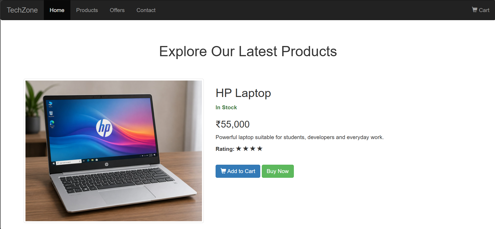
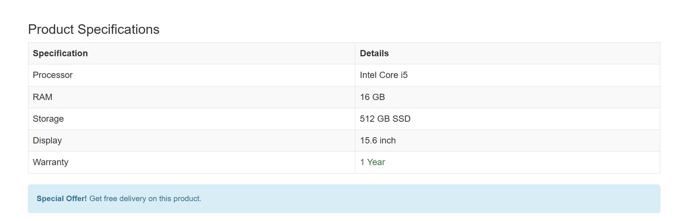

# Day 02 - Bootstrap Product Page

## Overview

Created a simple product page for a laptop using Bootstrap components and utility classes.

The task focused on creating a navigation bar, responsive product layout, product details table, buttons, icons, and an offer alert using Bootstrap.

## Topics Covered

- Bootstrap Navbar
- Container
- Grid System
- Rows and Columns
- Responsive Layout
- Images
- Buttons
- Glyphicons
- Tables
- Alerts
- Text Utilities
- Background and Text Colors

## Technologies Used

- HTML5
- Bootstrap 3.4.1
- jQuery

## Practice

Created a TechZone product page containing:

- Navigation bar
- Product image
- Product information
- Stock status
- Product price
- Product rating
- Add to Cart button
- Buy Now button
- Product specifications table
- Special offer alert

## Bootstrap Classes Used

- `navbar`
- `navbar-inverse`
- `container-fluid`
- `navbar-header`
- `navbar-brand`
- `navbar-nav`
- `navbar-right`
- `active`
- `container`
- `row`
- `col-sm-5`
- `col-sm-7`
- `img-responsive`
- `img-thumbnail`
- `text-center`
- `text-success`
- `btn`
- `btn-primary`
- `btn-success`
- `glyphicon`
- `glyphicon-shopping-cart`
- `glyphicon-star`
- `table`
- `table-striped`
- `table-bordered`
- `alert`
- `alert-info`

## Output

## Learning Outcome

Learned how to use Bootstrap's navbar, grid system, responsive columns, tables, buttons, icons, and alert components to create a structured product page.
