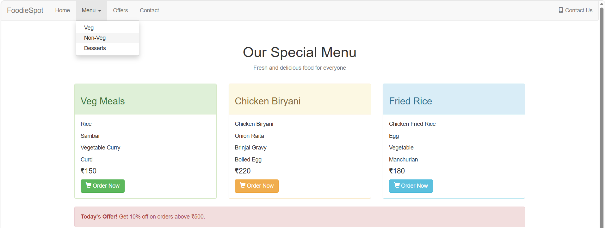
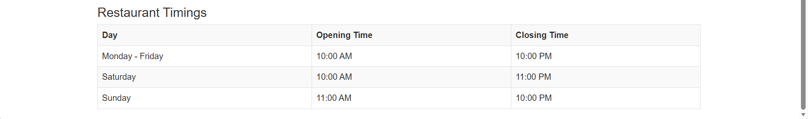

# Day 03 - Bootstrap Menu Page

## Overview

Created a simple restaurant menu page using Bootstrap components and utility classes.

The task focused on creating a navigation bar with a dropdown menu, responsive menu item layout, panels, buttons, icons, alerts, and a restaurant timings table.

## Topics Covered

- Bootstrap Navbar
- Dropdown Menu
- Container
- Grid System
- Rows and Columns
- Responsive Layout
- Panel Component
- Panel Heading
- Panel Body
- Buttons
- Glyphicons
- Alerts
- Tables
- Text Utilities
- Colors

## Technologies Used

- HTML5
- Bootstrap 3.4.1
- jQuery

## Practice

Created a FoodieSpot restaurant menu page containing:

- Navigation bar
- Dropdown menu
- Restaurant menu items
- Veg Meals
- Chicken Biryani
- Fried Rice
- Item prices
- Order Now buttons
- Shopping cart icons
- Today's offer
- Restaurant timings table

## Bootstrap Classes Used

- `navbar`
- `navbar-default`
- `container-fluid`
- `navbar-header`
- `navbar-brand`
- `navbar-nav`
- `navbar-right`
- `dropdown`
- `dropdown-toggle`
- `dropdown-menu`
- `caret`
- `container`
- `row`
- `col-sm-4`
- `panel`
- `panel-success`
- `panel-warning`
- `panel-info`
- `panel-heading`
- `panel-body`
- `btn`
- `btn-success`
- `btn-warning`
- `btn-info`
- `glyphicon`
- `glyphicon-shopping-cart`
- `glyphicon-phone`
- `alert`
- `alert-danger`
- `text-center`
- `text-muted`
- `table`
- `table-striped`
- `table-bordered`

## Output

## Learning Outcome

Learned how to use Bootstrap's navbar, dropdown, grid system, panels, buttons, icons, alerts, and tables to create a structured and responsive restaurant menu page.
