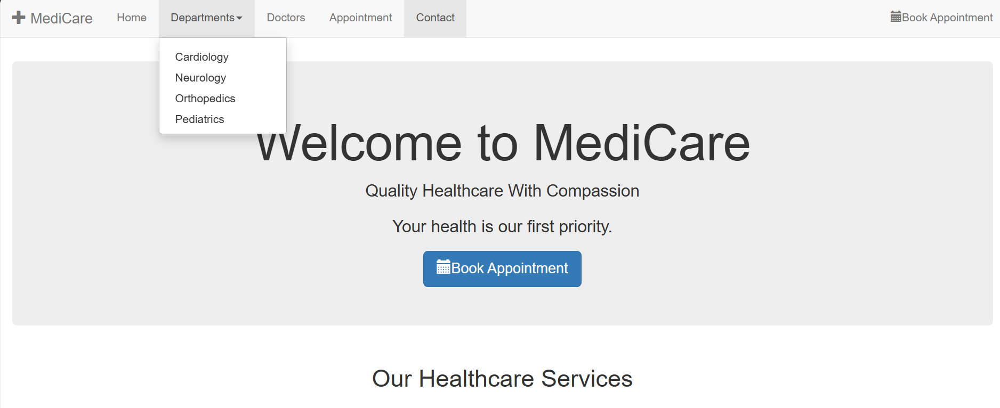
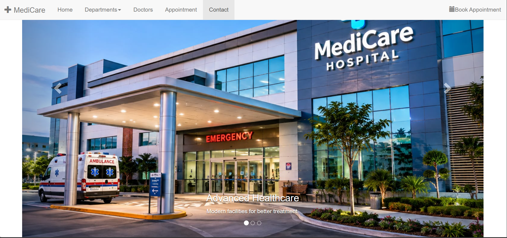
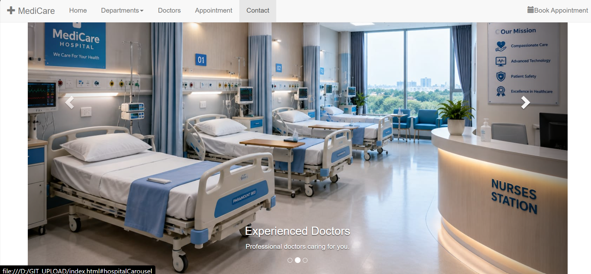
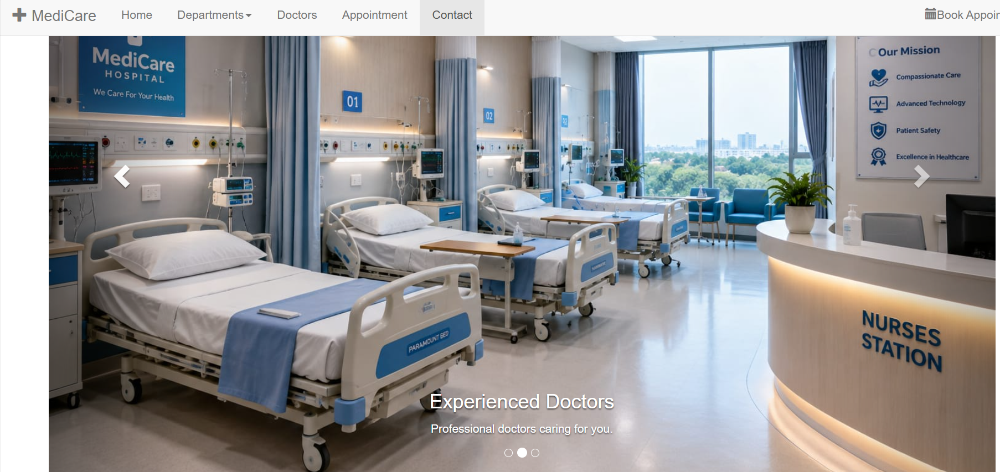
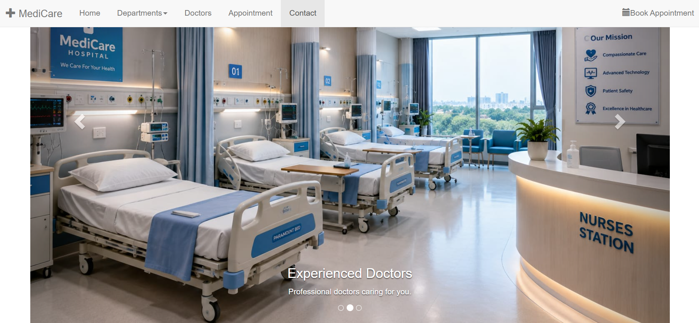
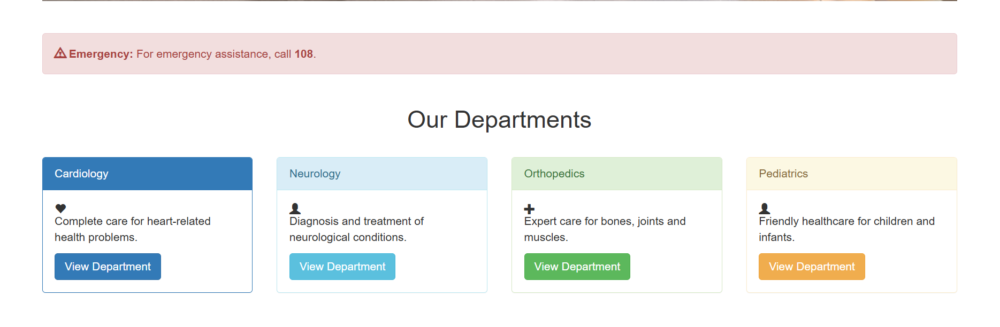
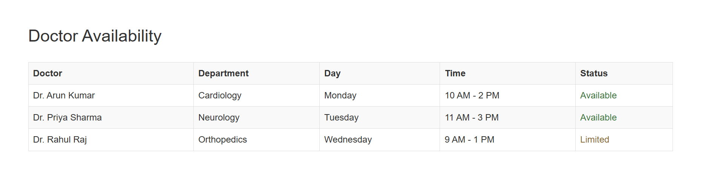
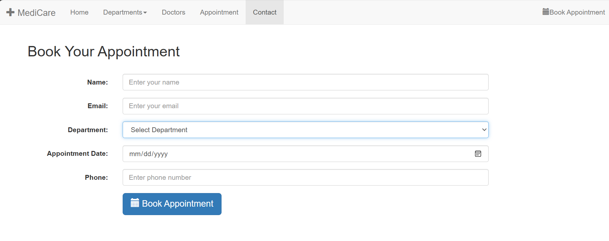

# Day 04 - Bootstrap Hospital Website

## Overview

Created a responsive hospital website using Bootstrap components, grid system, navigation, carousel, panels, tables, forms, alerts, and modal components.

The task focused on combining multiple Bootstrap components to build a complete multi-section webpage.

## Topics Covered

- Bootstrap Navbar
- Fixed Navbar
- Responsive Navbar
- Navbar Toggle
- Collapse
- Dropdown Menu
- Container
- Container Fluid
- Grid System
- Rows and Columns
- Responsive Layout
- Jumbotron
- Carousel
- Carousel Indicators
- Carousel Controls
- Panels
- Images
- Image Utilities
- Glyphicons
- Alerts
- Tables
- Forms
- Form Controls
- Modal
- Buttons
- Text Utilities
- Scrollspy

## Technologies Used

- HTML5
- Bootstrap 3.4.1
- jQuery

## Practice

Created a MediCare hospital website containing:

- Fixed navigation bar
- Department dropdown menu
- Hospital introduction section
- Healthcare services carousel
- Emergency alert
- Hospital departments
- Doctor profiles
- Doctor availability table
- Appointment booking form
- Appointment confirmation modal
- Contact section

## Bootstrap Components Used

- Navbar
- Dropdown
- Collapse
- Jumbotron
- Carousel
- Panel
- Alert
- Table
- Form
- Modal
- Buttons
- Glyphicons

## Bootstrap Classes Used

- `navbar`
- `navbar-default`
- `navbar-fixed-top`
- `navbar-toggle`
- `collapse`
- `navbar-collapse`
- `navbar-nav`
- `navbar-right`
- `dropdown`
- `dropdown-toggle`
- `dropdown-menu`
- `container`
- `container-fluid`
- `row`
- `col-sm-2`
- `col-sm-3`
- `col-sm-4`
- `col-sm-8`
- `jumbotron`
- `text-center`
- `carousel`
- `carousel-indicators`
- `carousel-inner`
- `carousel-caption`
- `carousel-control`
- `panel`
- `panel-primary`
- `panel-info`
- `panel-success`
- `panel-warning`
- `panel-heading`
- `panel-body`
- `alert`
- `alert-danger`
- `table`
- `table-striped`
- `table-bordered`
- `table-hover`
- `form-horizontal`
- `form-group`
- `control-label`
- `form-control`
- `modal`
- `modal-dialog`
- `modal-content`
- `modal-header`
- `modal-body`
- `modal-footer`
- `btn`
- `btn-primary`
- `btn-success`
- `btn-lg`
- `img-responsive`
- `img-circle`
- `glyphicon`
- `text-primary`
- `text-success`
- `text-info`
- `text-warning`

## Output

## Learning Outcome

Learned how to combine different Bootstrap components and utility classes to create a complete responsive hospital website with navigation, carousel, department sections, doctor details, appointment form, modal, and contact section.
