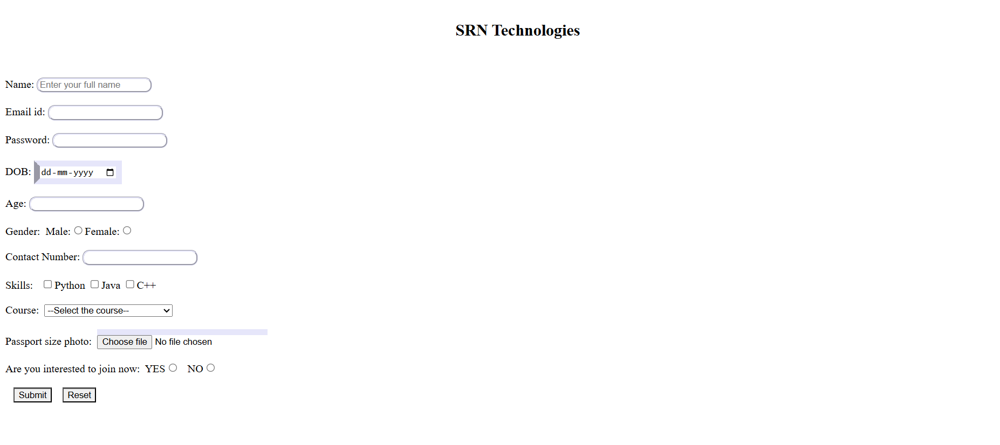

# Day 01 - CSS Basics

## Overview
Started learning CSS fundamentals by applying styles to an HTML application form. Practiced styling form elements using CSS classes, borders, border styles, border radius, and basic visual customization.

## Topics Covered
- Introduction to CSS
- Internal CSS
- CSS Selectors
- CSS Classes
- Border Properties
- Border Radius
- Border Styles
- Form Styling

## Technologies Used
- HTML5
- CSS3

## Practice
Created a student application form and enhanced its appearance using CSS. Applied different border styles, rounded corners, and customized input elements to understand basic CSS styling concepts.

## Output

### Output

