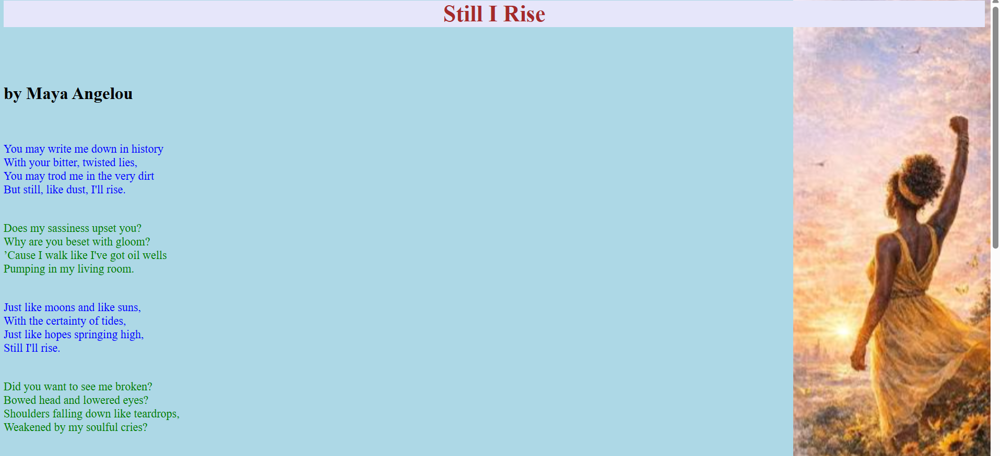
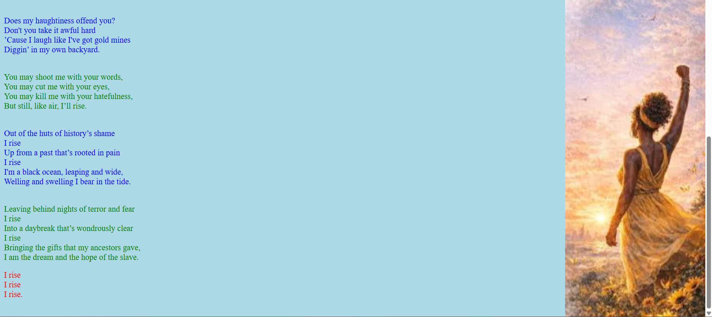

# Day 02 - CSS Styling

## Overview
Practiced CSS styling by creating a poem web page using HTML and CSS. Applied different CSS selectors, text colors, background properties, and background images to customize the appearance of the webpage.

## Topics Covered
- CSS Selectors
- ID Selector
- Class Selector
- Element Selector
- Text Color
- Background Color
- Background Image
- Background Repeat
- Background Attachment
- Background Position

## Technologies Used
- HTML5
- CSS3

## Practice
Created a poem web page and styled its content using ID, class, and element selectors. Applied different text colors and customized the page background using an image along with background repeat, attachment, and position properties.

## Output

### Output

