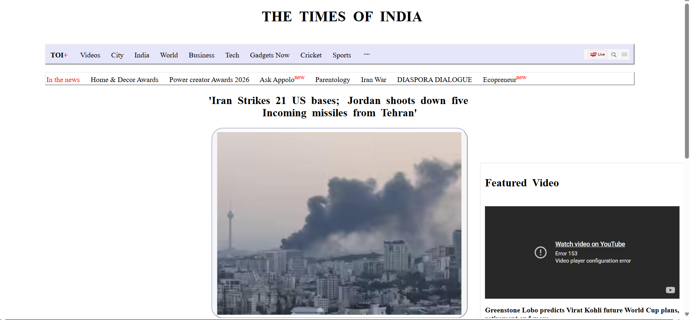
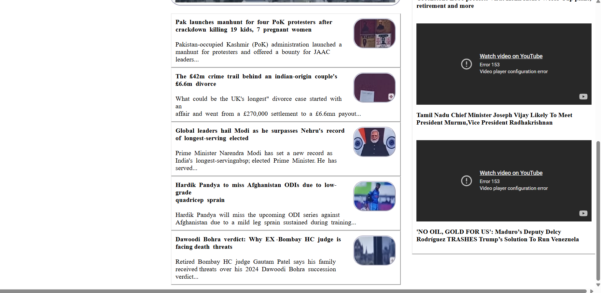

# Day-03 - CSS Layout Design

## Overview
Created a newspaper-style webpage inspired by The Times of India using HTML and CSS. Practiced page layout, spacing, borders, positioning, images, and embedded videos to build a structured news webpage.

## Topics Covered
- CSS Layout
- CSS Selectors
- Border Properties
- Border Radius
- Margin
- Padding
- Position (Absolute)
- Text Alignment
- Image Styling
- Iframe Embedding

## Technologies Used
- HTML5
- CSS3

## Practice
Designed a newspaper-style webpage with a navigation section, featured news articles, images, and embedded YouTube videos. Applied CSS properties such as borders, spacing, positioning, and border radius to organize and style the webpage.

## Output

### Output

