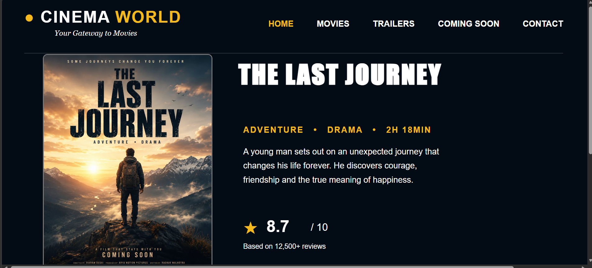
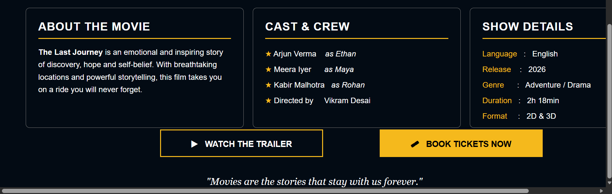

# Day 04 - CSS Movie Website

## Overview

Created a movie-themed webpage called "Cinema World" using HTML and CSS.

The task focused on creating a structured movie details page with custom styling, positioning, typography, colors, borders, images, and content sections.

## Topics Covered

- CSS Selectors
- CSS Properties
- Background Colors
- Text Colors
- Font Styling
- Font Family
- Font Size
- Font Weight
- Font Style
- Letter Spacing
- Margins
- Padding
- Borders
- Border Radius
- Absolute Positioning
- Image Styling
- Text Alignment
- Line Height
- Width and Height
- Object Fit
- Multiple Content Sections

## Technologies Used

- HTML5
- CSS3

## Practice

Created a Cinema World movie webpage containing:

- Website title and tagline
- Navigation menu
- Movie poster
- Movie title and description
- Movie rating
- About the movie section
- Cast and crew section
- Show details section
- Watch Trailer button
- Book Tickets button
- Movie quote

## CSS Concepts Used

- Class selectors
- `background-color`
- `color`
- `font-family`
- `font-size`
- `font-weight`
- `font-style`
- `letter-spacing`
- `margin`
- `padding`
- `border`
- `border-radius`
- `position`
- `top`
- `left`
- `right`
- `width`
- `height`
- `line-height`
- `text-align`
- `object-fit`

## Output

## Learning Outcome

Learned how to create and style a complete webpage using CSS properties, custom positioning, typography, spacing, borders, images, and multiple content sections.
