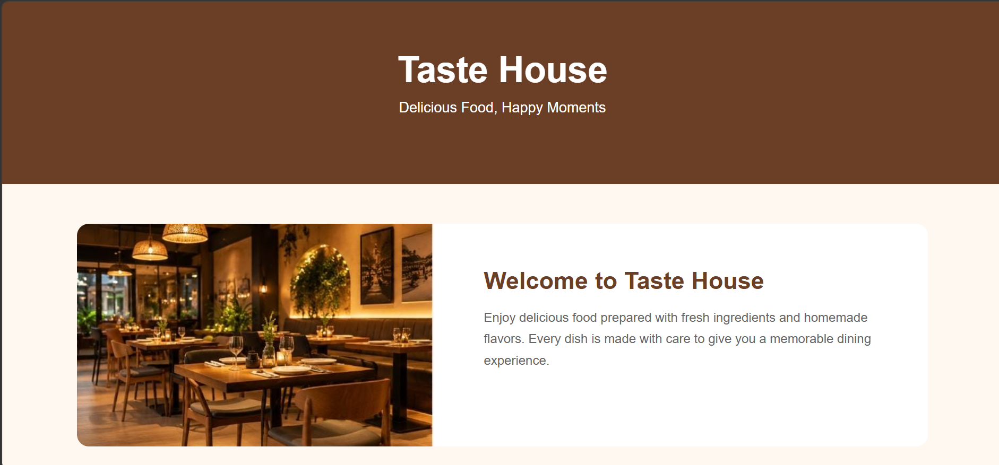
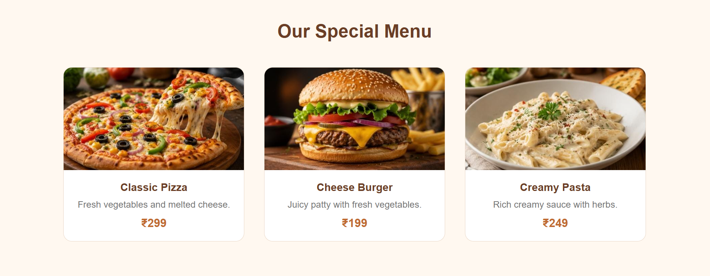
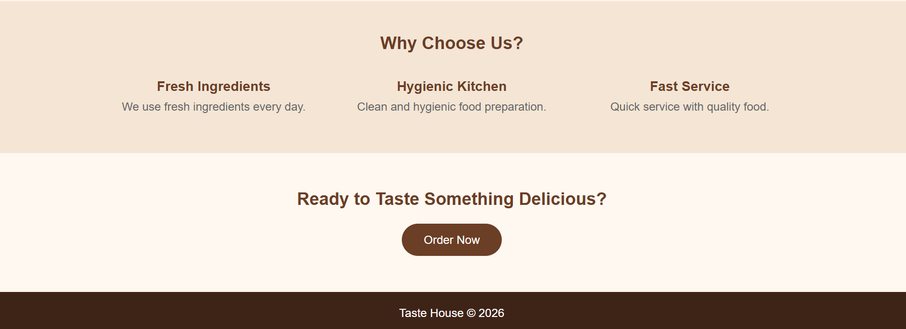

# Day 36 - CSS Restaurant Landing Page

## Overview

Created a restaurant landing page named Taste House using HTML and CSS with a clean food-themed design and multiple content sections.

## Topics Covered

- CSS Styling
- CSS Selectors
- Box Model
- Float Layout
- Inline-Block Layout
- Borders and Border Radius
- Background Colors
- Typography
- Hover Effects
- Transitions
- Image Styling
- Page Sections

## Technologies Used

- HTML5
- CSS3

## Practice

Performed the following operations:

- Created a restaurant hero section
- Added restaurant introduction section
- Created food menu cards
- Added food images and pricing
- Created a "Why Choose Us?" section
- Added order call-to-action section
- Created a footer section
- Added hover effects for buttons and food cards
- Styled the page using external-style CSS within the HTML document

## CSS Concepts Used

- Universal Selector
- Class Selectors
- `margin`
- `padding`
- `width`
- `height`
- `background`
- `color`
- `font-size`
- `font-family`
- `border`
- `border-radius`
- `box-sizing`
- `float`
- `display: inline-block`
- `vertical-align`
- `object-fit`
- `transition`
- `transform`
- `:hover`

## Output

## Learning Outcome

Learned how to create a complete restaurant landing page using HTML and CSS while practicing layouts, card designs, image styling, spacing, hover effects, transitions, and different page sections.
