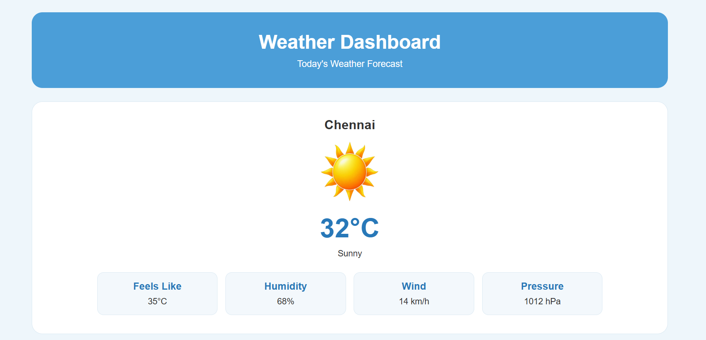
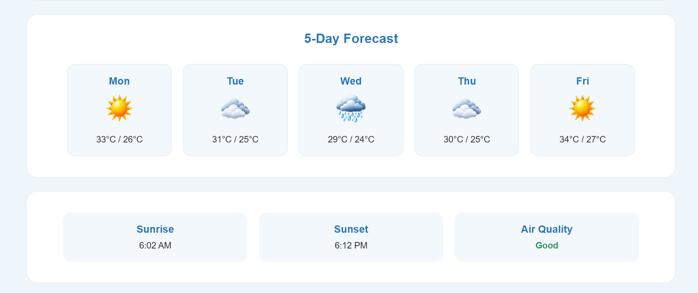

# Day 06 - CSS Weather Dashboard

## Overview

Created a Weather Dashboard using HTML and CSS to display current weather information, weather details, a 5-day forecast, and additional weather information.

## Topics Covered

- CSS Box Model
- CSS Layout
- Inline-Block Elements
- Border and Border Radius
- Hover Effects
- Responsive Design
- Media Queries
- Image Styling
- Typography
- Spacing and Alignment

## Technologies Used

- HTML5
- CSS3

## Practice

Performed the following operations:

- Created a weather dashboard layout
- Displayed current weather information
- Added temperature and weather condition
- Created weather detail cards
- Added 5-day weather forecast
- Added sunrise and sunset information
- Displayed air quality status
- Added hover effects to forecast cards
- Made the page responsive for mobile screens

## CSS Concepts Used

- `box-sizing`
- `margin`
- `padding`
- `background`
- `border`
- `border-radius`
- `display`
- `width`
- `height`
- `font-size`
- `font-weight`
- `transition`
- `transform`
- `@media`
- `object-fit`

## Output

## Learning Outcome

Learned how to create a clean and responsive Weather Dashboard using CSS layouts, cards, hover effects, image styling, and media queries.
