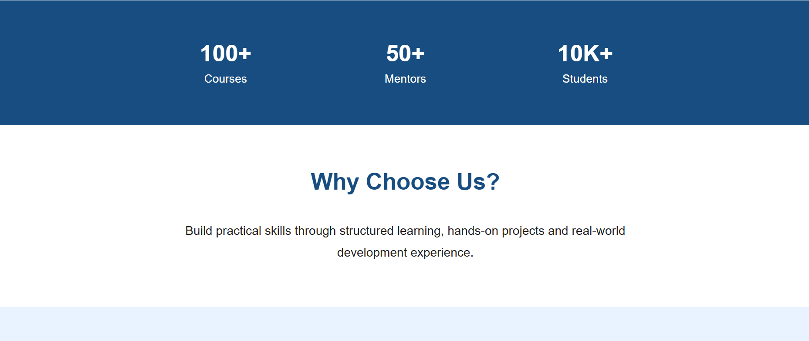
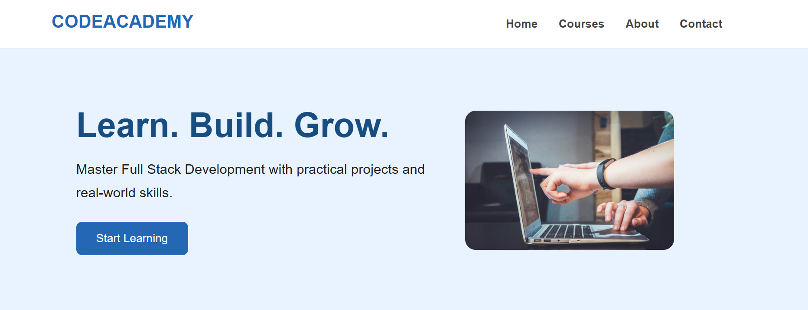

# Day 07 - CSS Online Learning Dashboard

## Overview

Created an Online Learning Dashboard using HTML and CSS with course cards, progress tracking, statistics, and recent learning activities.

## Topics Covered

- CSS Layout
- Box Model
- Inline Block
- Hover Effects
- Transitions
- Responsive Design
- Media Queries

## Technologies Used

- HTML5
- CSS3

## Practice

Performed the following operations:

- Created a navigation header
- Designed a welcome section
- Created course cards
- Added course progress bars
- Added learning buttons
- Created statistics section
- Added recent activity section
- Added hover effects
- Made the webpage responsive

## CSS Concepts Used

- `display`
- `inline-block`
- `padding`
- `margin`
- `width`
- `border`
- `border-radius`
- `box-shadow`
- `transition`
- `:hover`
- `@media`

## Output

## Learning Outcome

Learned how to create a responsive learning dashboard using CSS layouts, course cards, hover effects, transitions, progress bars, and media queries.
