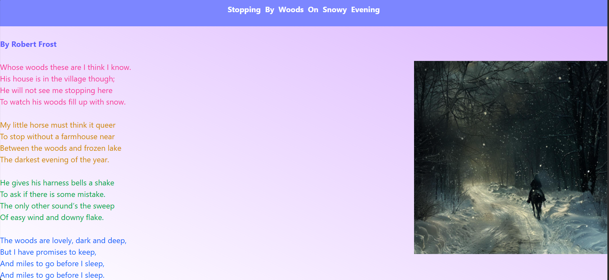

# Day-01 - Tailwind CSS

## Overview
Started learning Tailwind CSS by creating a styled poem webpage. Practiced using Tailwind utility classes for text colors, background colors, gradients, and image styling.

## Topics Covered
- Introduction to Tailwind CSS
- Tailwind CSS CDN
- Utility Classes
- Text Color
- Background Color
- Background Gradient
- Gradient Direction
- Image Styling

## Technologies Used
- HTML5
- Tailwind CSS

## Practice
Created a poem webpage using Tailwind CSS utility classes. Applied different text colors, background gradients, and image styling to create a visually appealing webpage.

## Output

### Output

