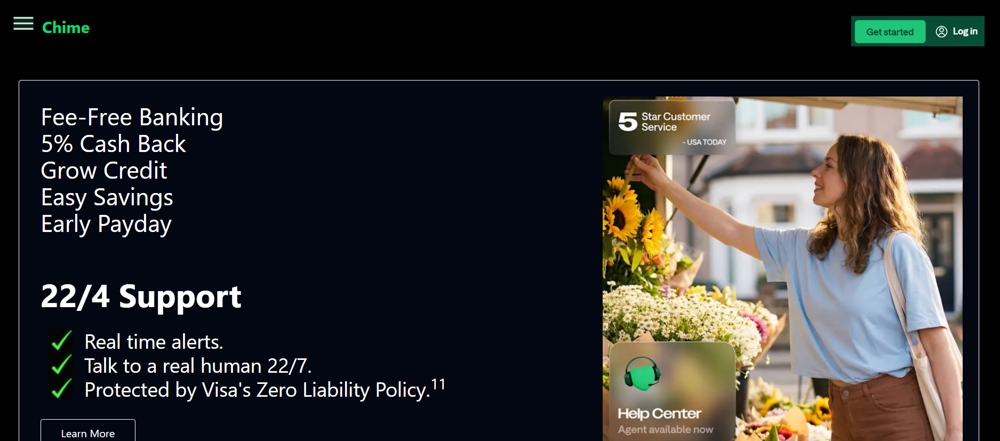
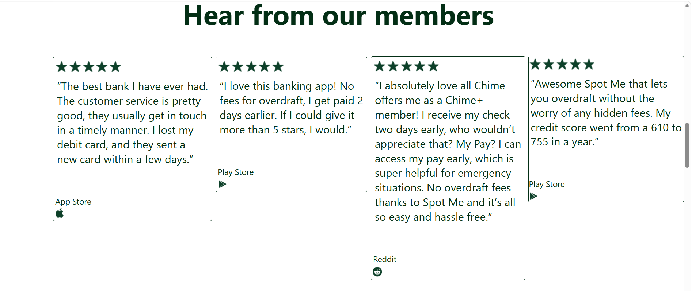

# Day-02 - Tailwind CSS

## Overview
Continued learning Tailwind CSS by creating a Chime-inspired banking webpage. Practiced using Tailwind utility classes for layouts, spacing, colors, borders, typography, and image positioning.

## Topics Covered
- Tailwind CSS Utility Classes
- Text Styling
- Background Colors
- Borders
- Border Radius
- Spacing
- Margin and Padding
- Width and Height
- Image Positioning
- Layout Positioning

## Technologies Used
- HTML5
- Tailwind CSS

## Practice
Created a banking webpage inspired by Chime using Tailwind CSS utility classes. Applied different layouts, colors, spacing, borders, typography, and image positioning to build multiple sections of the webpage.

## Output

