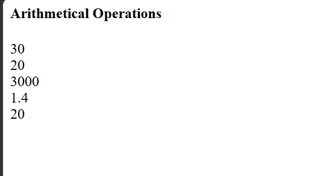

# Day-01 - JavaScript

## Overview
Started learning JavaScript by creating a simple webpage to perform basic arithmetic operations. Practiced using variables and arithmetic operators to calculate and display different results.

## Topics Covered
- Introduction to JavaScript
- `<script>` Tag
- Variables
- Arithmetic Operators
- Addition
- Subtraction
- Multiplication
- Division
- Modulus
- `document.write()`

## Technologies Used
- HTML5
- JavaScript

## Practice
Created a simple arithmetic operations webpage using JavaScript. Performed addition, subtraction, multiplication, division, and modulus operations using variables and displayed the results on the webpage.

## Output

### Output

