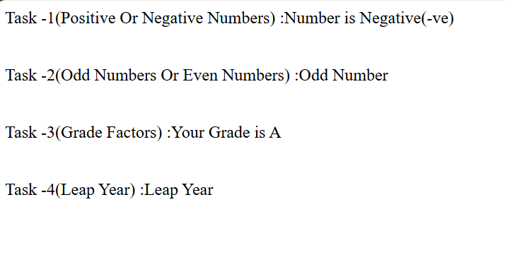

# Day-02 - JavaScript

## Overview
Continued learning JavaScript by creating a simple webpage to practice conditional statements. Implemented different tasks using `if`, `else if`, and `else` conditions.

## Topics Covered
- Conditional Statements
- `if` Statement
- `else if` Statement
- `else` Statement
- Comparison Operators
- Logical Operators
- Modulus Operator
- Positive and Negative Numbers
- Odd and Even Numbers
- Grade Calculation
- Leap Year

## Technologies Used
- HTML5
- JavaScript

## Practice
Created a JavaScript webpage with four tasks:
- Checked whether a number is positive, negative, or zero.
- Checked whether a number is odd or even.
- Calculated grades based on marks.
- Checked whether a year is a leap year.

## Output

### Output

