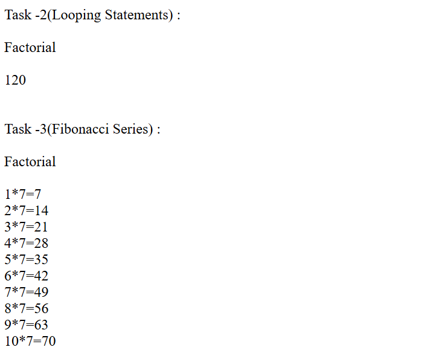
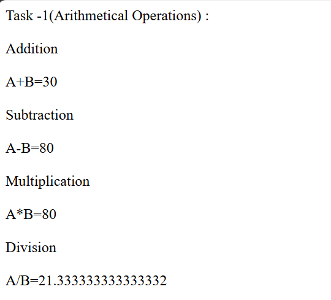

# Day-03 - JavaScript

## Overview
Continued learning JavaScript by practicing functions and looping statements. Created different tasks to understand how functions can perform calculations and how loops can be used to repeat operations.

## Topics Covered
- JavaScript Functions
- Function Declaration
- Function Parameters
- Return Statement
- Function Calling
- Arithmetic Operations
- For Loop
- Factorial
- Fibonacci Series
- Multiplication Tables

## Technologies Used
- HTML5
- JavaScript

## Practice
Created JavaScript programs using functions and looping statements. Practiced performing arithmetic operations through functions, calculating factorials, working with number series, and generating multiplication tables using `for` loops.

## Output

