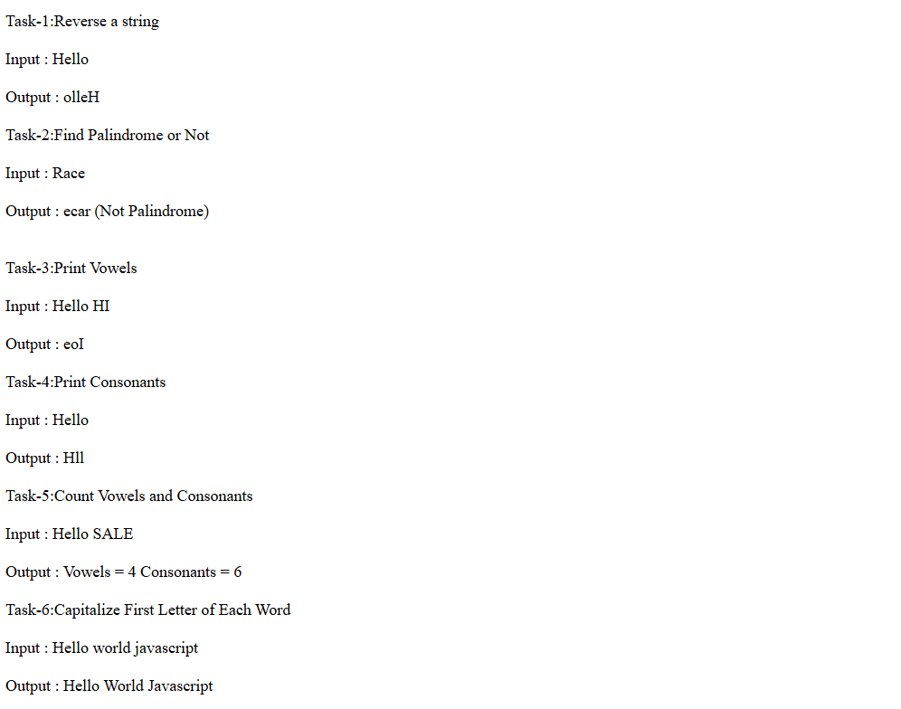

# Day-05 - JavaScript

## Overview
Continued learning JavaScript by practicing the `map()` method with arrays. Created different tasks to transform array values, add indexes, modify strings, apply conditional logic, and format numbers.

## Topics Covered
- JavaScript Arrays
- `map()` Method
- Arrow Functions
- Callback Functions
- Array Transformation
- Array Index
- String Conversion
- String Methods
- Conditional Logic
- `charAt()`
- `toUpperCase()`
- `slice()`
- Template/String Concatenation

## Technologies Used
- HTML5
- JavaScript

## Practice
Created JavaScript programs using the `map()` method to perform different array operations. Practiced converting numbers to strings, adding indexes to array values, capitalizing the first letter of words, applying pass/fail conditions to scores, and formatting numbers with a currency symbol.

## Output

### Output

