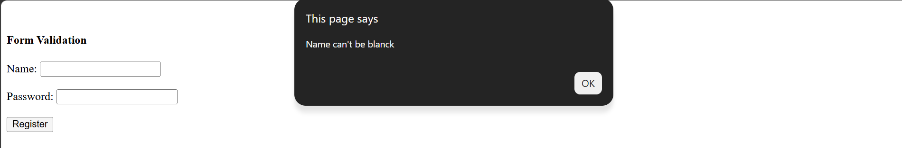

# Day-06 - JavaScript

## Overview
Continued learning JavaScript by practicing form validation. Created a simple registration form and used JavaScript to validate user inputs before submitting the form.

## Topics Covered
- Form Validation
- HTML Forms
- Input Fields
- Form Submission
- `onsubmit`
- JavaScript Functions
- `if...else if...else`
- `return true`
- `return false`
- Input Value Validation
- Password Length Validation
- `document.frm1`
- `.value`
- `.length`
- `alert()`

## Technologies Used
- HTML5
- JavaScript

## Practice
Created a simple registration form with Name and Password fields. Practiced validating whether the Name field is empty and checking whether the Password contains at least 6 characters. Used JavaScript to display alert messages and prevent form submission when the validation fails.

## Output

