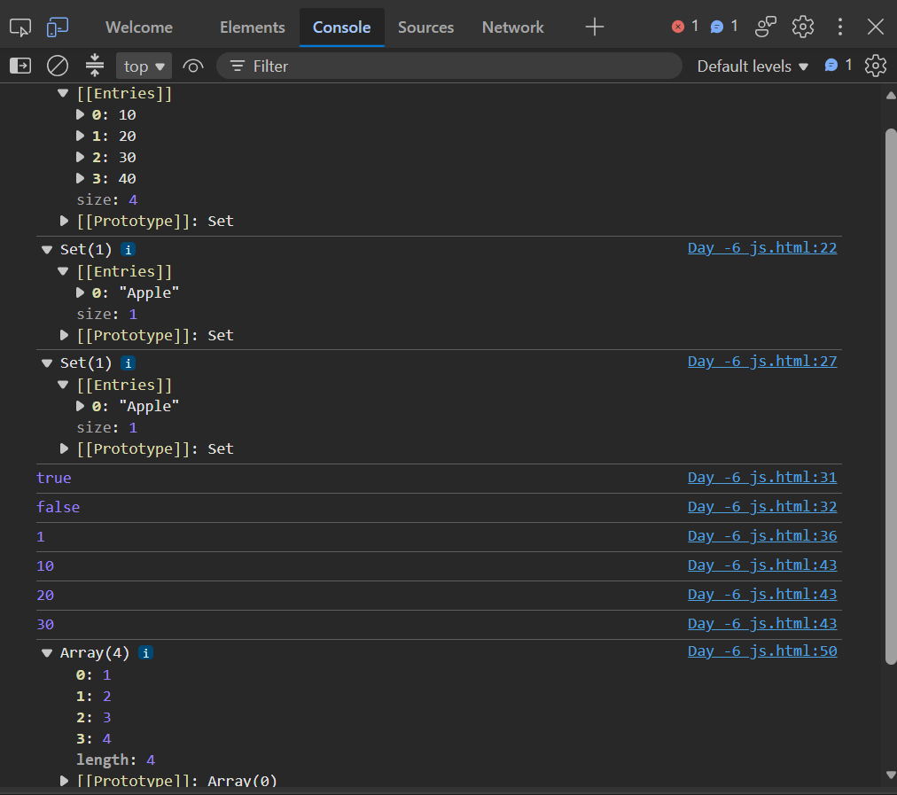

# Day-07 - JavaScript

## Overview
Continued learning JavaScript by practicing the `Set` object. Created different tasks to understand how Sets store unique values and how to add, delete, search, count, and iterate through Set elements.

## Topics Covered
- JavaScript Set
- Creating a Set
- Adding Values to a Set
- Deleting Values from a Set
- `has()` Method
- `size` Property
- Looping Through a Set
- Converting an Array to a Set
- Removing Duplicate Values
- Spread Operator

## Technologies Used
- HTML5
- JavaScript

## Practice
Created JavaScript programs using the `Set` object to work with unique values. Practiced creating Sets, adding and deleting values, checking whether a value exists, finding the size of a Set, looping through Set elements, and converting an array into a Set to remove duplicate values.

## Output

### Output

