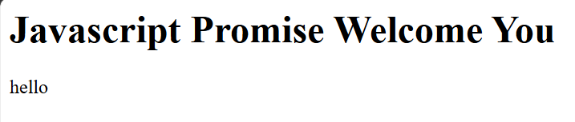

# Day-09 - JavaScript

## Overview
Continued learning JavaScript by practicing Promises and asynchronous operations. Created a simple JavaScript Promise that resolves after a delay and displays the resolved value on the webpage.

## Topics Covered
- JavaScript Promise
- Creating a Promise
- `resolve()`
- `reject()`
- `setTimeout()`
- `then()`
- Asynchronous JavaScript
- DOM Manipulation
- `getElementById()`
- `innerHTML`

## Technologies Used
- HTML5
- JavaScript

## Practice
Created a simple JavaScript Promise that displays a welcome message after a 3-second delay. Practiced handling the resolved value using the `then()` method and displaying the result dynamically using DOM manipulation.

## Output

