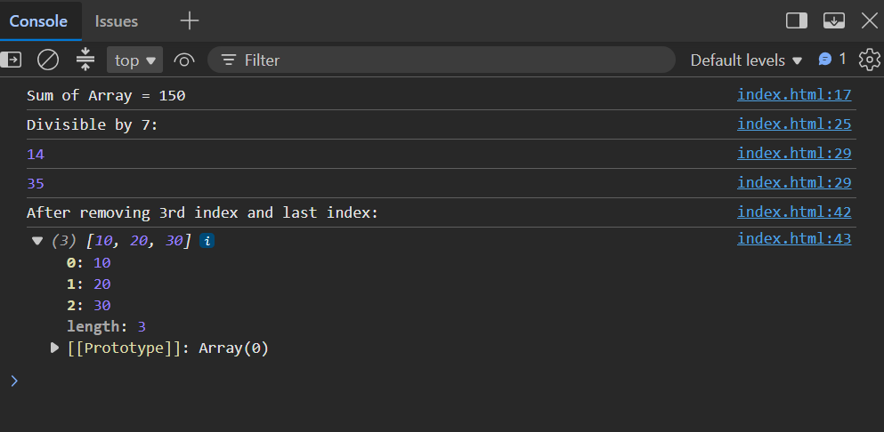

# Day 11 - JavaScript Arrays and Functions

## Overview

Started learning JavaScript by practicing arrays, functions, loops, conditional statements, and array methods.

The task focused on performing basic operations on arrays such as finding the sum of elements, finding elements divisible by 7, and removing elements using the `splice()` method.

## Topics Covered

- JavaScript Functions
- Arrays
- Array Length
- For Loop
- If Condition
- Modulus Operator
- Array `splice()` Method
- Function Calling
- Console Output

## Technologies Used

- HTML5
- JavaScript

## Practice

Performed the following array operations:

- Calculated the sum of array elements
- Found elements divisible by 7
- Removed the element at the 3rd index
- Removed the last element from an array
- Displayed the results using `console.log()`

## JavaScript Concepts Used

- `function`
- `let`
- Array
- `.length`
- `for` loop
- `if` condition
- `%` operator
- `.splice()`
- `console.log()`

## Output

## Learning Outcome

Learned how to work with arrays and functions in JavaScript and perform basic array operations using loops, conditions, and the `splice()` method.
