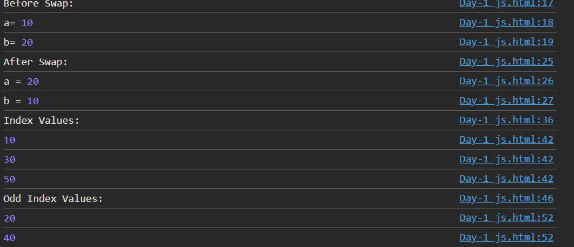

# Day 12 - JavaScript Number Swapping and Array Index

## Overview

Continued learning JavaScript by practicing number swapping and working with array index values.

The task focused on swapping two numbers without using a temporary variable and identifying values at even and odd indexes using loops and conditions.

## Topics Covered

- JavaScript Functions
- Variables
- Arrays
- Array Index
- Array Length
- For Loop
- If Condition
- Arithmetic Operators
- Modulus Operator
- Function Calling
- Console Output

## Technologies Used

- HTML5
- JavaScript

## Practice

Performed the following JavaScript tasks:

- Swapped two numbers without using a temporary variable
- Displayed values at even indexes
- Displayed values at odd indexes
- Used loops to access array elements
- Used conditions to check index positions

## JavaScript Concepts Used

- `function`
- `let`
- Array
- `.length`
- `for` loop
- `if` condition
- `%` operator
- Arithmetic operators
- `console.log()`

## Output

## Learning Outcome

Learned how to swap values using arithmetic operations and how to access and separate array values based on even and odd index positions.
