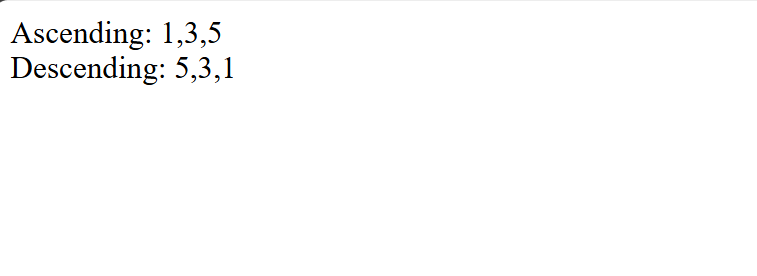

# Day 13 - JavaScript Array Sorting

## Overview

Practiced sorting array elements in ascending and descending order using JavaScript.

The task focused on using nested `for` loops, conditional statements, and a temporary variable to compare and swap array elements.

## Topics Covered

- JavaScript Arrays
- Nested `for` Loops
- Array Length
- Array Index
- `if` Condition
- Comparison Operators
- Swapping Array Elements
- Temporary Variable
- `document.write()`

## Technologies Used

- HTML5
- JavaScript

## Practice

Performed the following array operations:

- Created an array with numeric values
- Compared array elements using nested loops
- Sorted the array in ascending order
- Sorted the array in descending order
- Swapped array elements using a temporary variable
- Displayed the sorted results on the webpage

## JavaScript Concepts Used

- `let`
- Array
- `.length`
- Nested `for` loop
- `if` condition
- `>` operator
- `<` operator
- Temporary variable
- `document.write()`

## Output

## Learning Outcome

Learned how to compare and swap array elements using nested loops and conditions to arrange values in ascending and descending order.
