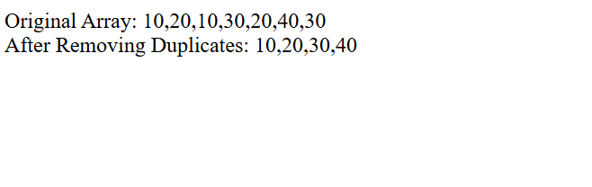

# Day 15 - JavaScript Remove Duplicate Values

## Overview

Practiced removing duplicate values from an array using JavaScript.

The task focused on using nested `for` loops and conditions to check whether an element already exists in another array before adding it.

## Topics Covered

- JavaScript Arrays
- Nested `for` Loops
- Array Index
- Array Length
- If Condition
- Boolean Values
- Array `push()` Method
- Duplicate Value Checking
- `document.write()`

## Technologies Used

- HTML5
- JavaScript

## Practice

Performed the following array operations:

- Created an array containing duplicate values
- Created an empty array to store unique values
- Checked whether each value already exists
- Added only unique values to the new array
- Displayed the original and updated arrays

## JavaScript Concepts Used

- `let`
- Array
- `.length`
- Nested `for` loop
- `if` condition
- Boolean value
- `.push()`
- `document.write()`

## Output

## Learning Outcome

Learned how to identify and remove duplicate values from an array using nested loops, conditions, and the `push()` method.
