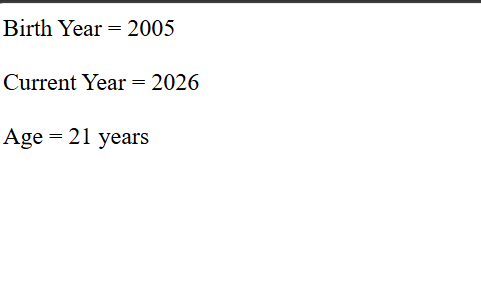

# Day 17 - JavaScript Age Calculator

## Overview

Created a simple Age Calculator using JavaScript to calculate a person's age based on their birth year and the current year.

The task focused on using variables and arithmetic operations to calculate the difference between two years.

## Topics Covered

- JavaScript Variables
- Arithmetic Operators
- Subtraction
- Age Calculation
- `document.write()`

## Technologies Used

- HTML5
- JavaScript

## Practice

Performed the following operations:

- Stored the birth year in a variable
- Stored the current year in a variable
- Calculated age by subtracting the birth year from the current year
- Displayed the birth year
- Displayed the current year
- Displayed the calculated age

## JavaScript Concepts Used

- `let`
- Variables
- Arithmetic operator `-`
- `document.write()`

## Output

## Learning Outcome

Learned how to use JavaScript variables and arithmetic operations to calculate and display a person's age.
