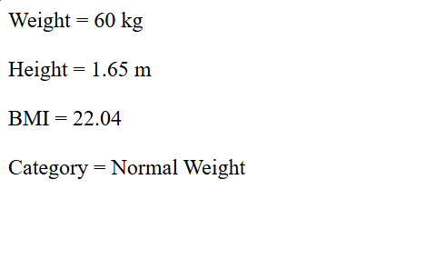

# Day 18 - JavaScript BMI Calculator

## Overview

Created a simple BMI Calculator using JavaScript to calculate Body Mass Index based on weight and height.

The task focused on performing mathematical calculations and using conditional statements to determine the BMI category.

## Topics Covered

- JavaScript Variables
- Arithmetic Operators
- BMI Calculation
- Decimal Formatting
- `toFixed()` Method
- If-Else If-Else Conditions
- Comparison Operators
- Conditional Statements
- `document.write()`

## Technologies Used

- HTML5
- JavaScript

## Practice

Performed the following operations:

- Stored weight and height in variables
- Calculated BMI using the BMI formula
- Formatted the BMI value to two decimal places
- Checked the BMI value using conditional statements
- Displayed the appropriate BMI category

## BMI Categories

- Below 18.5 - Underweight
- 18.5 to below 25 - Normal Weight
- 25 to below 30 - Overweight
- 30 and above - Obese

## JavaScript Concepts Used

- `let`
- Variables
- Arithmetic operators
- `if`
- `else if`
- `else`
- Comparison operators
- `.toFixed()`
- `document.write()`

## Output

## Learning Outcome
Learned how to perform mathematical calculations in JavaScript and use conditional statements to classify a calculated BMI value into different categories.
