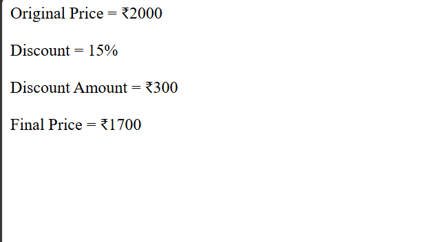

# Day 19 - JavaScript Discount Calculator

## Overview

Created a simple Discount Calculator using JavaScript to calculate the discount amount and final price of a product.

The task focused on using variables and arithmetic operations to calculate the discount percentage and the final price after applying the discount.

## Topics Covered

- JavaScript Variables
- Arithmetic Operators
- Percentage Calculation
- Discount Calculation
- Subtraction
- Mathematical Expressions
- `document.write()`

## Technologies Used

- HTML5
- JavaScript

## Practice

Performed the following operations:

- Stored the original price in a variable
- Stored the discount percentage
- Calculated the discount amount
- Calculated the final price after discount
- Displayed the original price
- Displayed the discount percentage
- Displayed the discount amount
- Displayed the final price

## Formula Used

**Discount Amount**

`Original Price × Discount Percentage / 100`

**Final Price**

`Original Price - Discount Amount`

## JavaScript Concepts Used

- `let`
- Variables
- Arithmetic operators
- Multiplication `*`
- Division `/`
- Subtraction `-`
- `document.write()`

## Output

## Learning Outcome

Learned how to use JavaScript variables and arithmetic operations to calculate discount amounts and determine the final price of a product after applying a discount.
