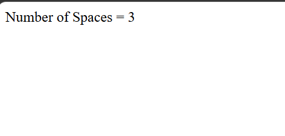

# Day 23 - JavaScript Count Number of Spaces

## Overview

Created a simple JavaScript program to count the number of spaces present in a given string.

The task focused on using a `for` loop to traverse through each character of the string and the `charAt()` method to check for spaces.

## Topics Covered

- JavaScript Strings
- String Length
- `for` Loop
- `if` Condition
- `charAt()` Method
- Character Checking
- Counter Variable
- Increment Operator
- `document.write()`

## Technologies Used

- HTML5
- JavaScript

## Practice

Performed the following operations:

- Stored a string in a variable
- Traversed through each character using a `for` loop
- Used `charAt()` to access individual characters
- Checked whether each character is a space
- Counted the number of spaces
- Displayed the total number of spaces

## JavaScript Concepts Used

- `let`
- Strings
- `.length`
- `for` loop
- `if` condition
- `.charAt()`
- Counter variable
- `++` operator
- `document.write()`

## Output

## Learning Outcome

Learned how to traverse a string character by character and count specific characters using the `charAt()` method, loop, and conditional statement.
