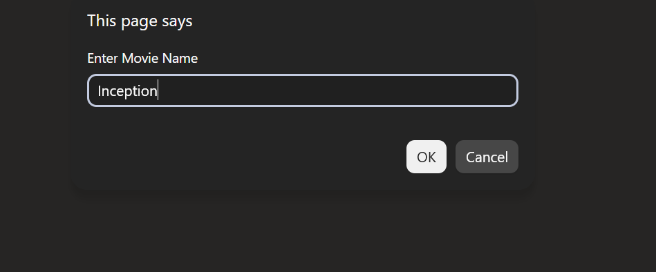
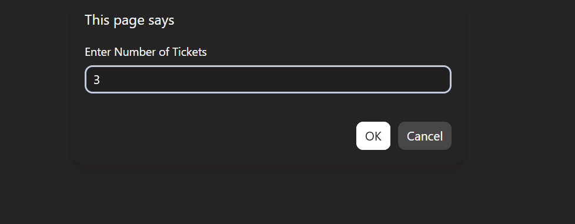
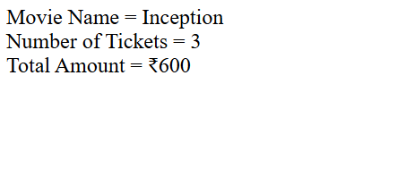

# Day 24 - JavaScript Movie Ticket Booking

## Overview

Created a simple Movie Ticket Booking program using JavaScript to calculate the total ticket amount based on the number of tickets selected.

The task focused on using functions, user input, nested loops, string methods, and arithmetic operations to calculate and display the total booking amount.

## Topics Covered

- JavaScript Functions
- Function Parameters
- Return Statement
- User Input
- `prompt()` Method
- `Number()` Method
- Strings
- String Methods
- `toLowerCase()` Method
- `includes()` Method
- Nested `for` Loops
- Arithmetic Operations
- `document.write()`

## Technologies Used

- HTML5
- JavaScript

## Practice

Performed the following operations:

- Asked the user to enter a movie name
- Asked the user to enter the number of tickets
- Converted the ticket input into a number
- Created a function to calculate the total ticket amount
- Used loops to calculate the price for each ticket
- Used string methods to work with the movie name
- Returned the calculated total amount
- Displayed the movie name, number of tickets, and total amount

## JavaScript Concepts Used

- `function`
- Function parameters
- `return`
- `let`
- `prompt()`
- `Number()`
- `for` loop
- Nested `for` loop
- `.toLowerCase()`
- `.includes()`
- Arithmetic operators
- `document.write()`

## Output

## Learning Outcome

Learned how to create a function with parameters and return a calculated value, take input from the user, use nested loops, and apply string methods in a practical movie ticket booking task.
