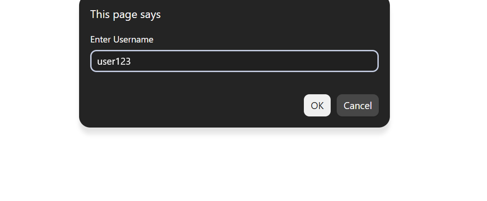
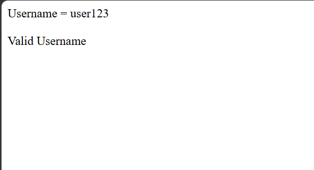
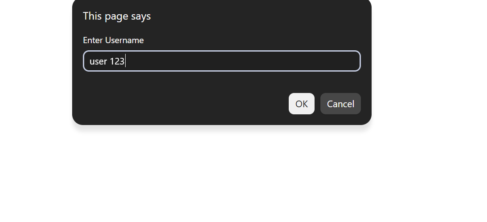
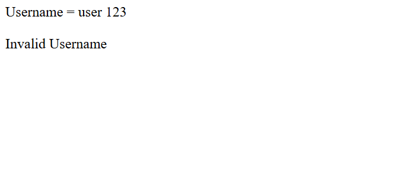

# Day 25 - JavaScript Username Validator

## Overview

Created a simple Username Validator using JavaScript to check whether a username satisfies specific validation conditions.

The task focused on using functions, string properties, string methods, logical operators, and conditional statements to validate user input.

## Topics Covered

- JavaScript Functions
- Function Parameters
- Return Statement
- User Input
- `prompt()` Method
- Strings
- String Length
- `startsWith()` Method
- `includes()` Method
- Logical Operators
- If-Else Condition
- Input Validation
- `document.write()`

## Technologies Used

- HTML5
- JavaScript

## Validation Rules

The username is considered valid when:

- The username contains at least 5 characters
- The username contains at most 15 characters
- The username starts with `"user"`
- The username does not contain spaces

If all conditions are satisfied, the program displays `Valid Username`. Otherwise, it displays `Invalid Username`.

## Practice

Performed the following operations:

- Asked the user to enter a username
- Passed the username to a validation function
- Checked the username length
- Checked whether the username starts with `"user"`
- Checked whether the username contains spaces
- Combined multiple conditions using logical operators
- Returned the validation result
- Displayed the username and validation result

## JavaScript Concepts Used

- `function`
- Function parameters
- `return`
- `let`
- `prompt()`
- `.length`
- `.startsWith()`
- `.includes()`
- `&&` operator
- `!` operator
- `if-else`
- `document.write()`

## Output

## Learning Outcome

Learned how to validate user input using string methods, logical operators, conditional statements, and functions in JavaScript.
