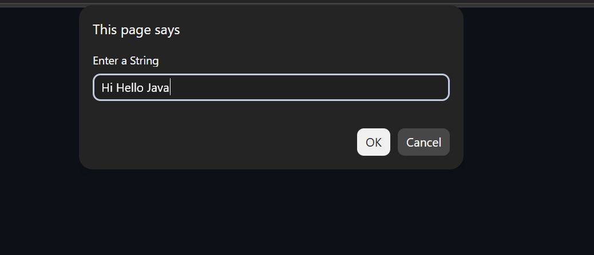
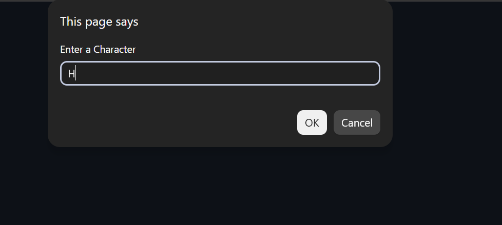
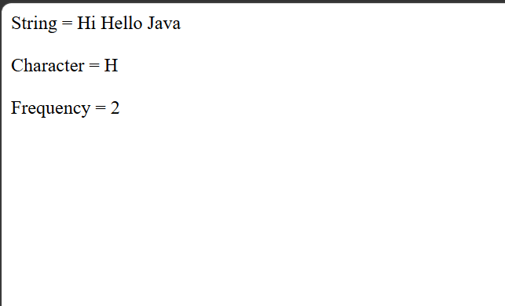

# Day 26 - JavaScript Character Frequency

## Overview

Created a simple Character Frequency program using JavaScript to count how many times a specified character occurs in a given string.

The task focused on using functions, string traversal, `charAt()`, loops, conditions, and user input to calculate the frequency of a character.

## Topics Covered

- JavaScript Functions
- Function Parameters
- Return Statement
- User Input
- `prompt()` Method
- Strings
- String Length
- `charAt()` Method
- `for` Loop
- `if` Condition
- Counter Variable
- Character Comparison
- `document.write()`

## Technologies Used

- HTML5
- JavaScript

## Practice

Performed the following operations:

- Asked the user to enter a string
- Asked the user to enter a character
- Passed both values to a function
- Traversed through each character using a `for` loop
- Used `charAt()` to access individual characters
- Compared each character with the given character
- Counted the number of occurrences
- Returned the frequency
- Displayed the result

## JavaScript Concepts Used

- `function`
- Function parameters
- `return`
- `let`
- `prompt()`
- `.length`
- `.charAt()`
- `for` loop
- `if` condition
- Counter variable
- `++` operator
- `document.write()`

## Output

## Learning Outcome

Learned how to traverse a string character by character and calculate the frequency of a specific character using functions, loops, conditions, and the `charAt()` method.
