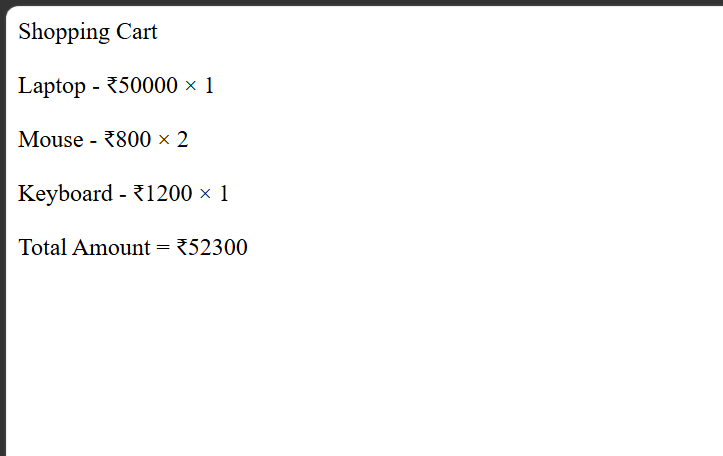

# Day 27 - JavaScript Shopping Cart

## Overview

Created a simple Shopping Cart program using JavaScript to calculate the total amount of multiple products based on their prices and quantities.

The task focused on using functions, arrays, loops, conditions, array methods, and arithmetic operations to calculate the cart total and apply a product-based discount.

## Topics Covered

- JavaScript Functions
- Function Parameters
- Return Statement
- Arrays
- Array Indexing
- Array `length`
- `for` Loop
- `if` Condition
- `includes()` Method
- Arithmetic Operations
- Product Price Calculation
- Quantity Calculation
- Discount Calculation
- `document.write()`

## Technologies Used

- HTML5
- JavaScript

## Practice

Performed the following operations:

- Created arrays for products, prices, and quantities
- Passed multiple arrays to a function
- Calculated the price of each product based on its quantity
- Calculated the total shopping cart amount
- Checked whether the cart contains a Laptop
- Applied a ₹500 discount when a Laptop is included
- Displayed all products with their prices and quantities
- Displayed the final cart amount

## JavaScript Concepts Used

- `function`
- Function parameters
- `return`
- `let`
- Arrays
- `.length`
- Array indexing
- `for` loop
- `if` condition
- `.includes()`
- Arithmetic operators
- `document.write()`

## Calculation

**Product Total**

`Price × Quantity`

**Cart Total**

`Sum of all Product Totals`

**Laptop Discount**

`Cart Total - ₹500`

## Output

## Learning Outcome

Learned how to work with multiple arrays, use loops to calculate product totals, apply conditional discounts, and create a simple shopping cart calculation using JavaScript.
