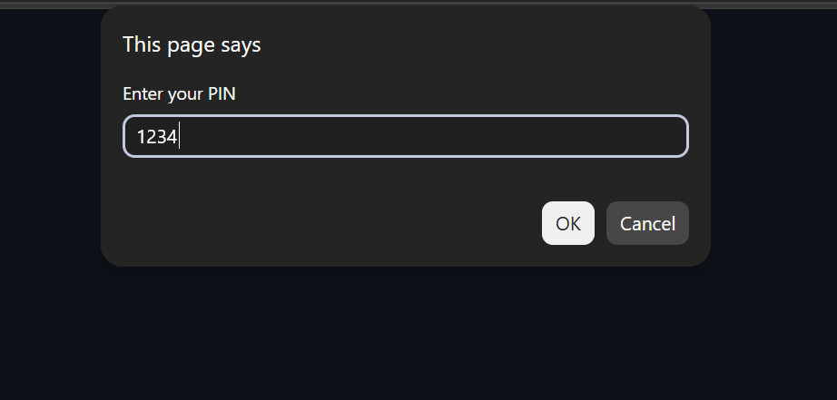
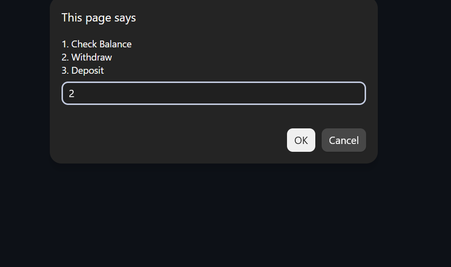
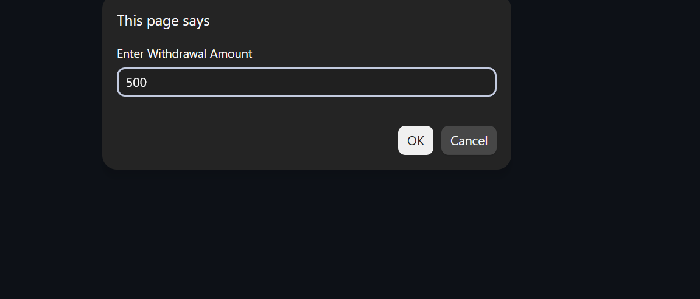
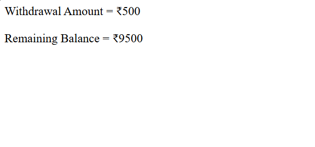

# Day 28 - JavaScript ATM Simulation

## Overview

Created a simple ATM Simulation program using JavaScript to perform basic banking operations.

The task focused on using functions, user input, conditional statements, arithmetic operations, and nested conditions to simulate PIN verification, balance checking, withdrawal, and deposit operations.

## Topics Covered

- JavaScript Functions
- Function Parameters
- User Input
- `prompt()` Method
- `Number()` Method
- If-Else If-Else Conditions
- Nested Conditional Statements
- Comparison Operators
- Logical Operators
- Arithmetic Operations
- Balance Calculation
- PIN Verification
- Withdrawal
- Deposit
- `document.write()`

## Technologies Used

- HTML5
- JavaScript

## ATM Operations

The program provides the following options:

- Check Balance
- Withdraw Money
- Deposit Money

The user must enter the correct PIN before accessing the ATM operations.

## Practice

Performed the following operations:

- Created a function for ATM operations
- Asked the user to enter a PIN
- Verified the entered PIN
- Displayed ATM operation choices
- Checked the current balance
- Processed withdrawal requests
- Validated the withdrawal amount
- Checked available balance before withdrawal
- Processed deposit requests
- Validated the deposit amount
- Updated the account balance
- Handled invalid choices and invalid amounts
- Displayed the transaction results

## JavaScript Concepts Used

- `function`
- Function parameters
- `return`
- `let`
- `prompt()`
- `Number()`
- `if`
- `else if`
- `else`
- Nested `if-else`
- `&&` operator
- Comparison operators
- Arithmetic operators
- `document.write()`

## Validation Conditions

### PIN Verification

The entered PIN must match the stored PIN.

### Withdrawal

- Amount must be greater than `0`
- Amount must not exceed the available balance

### Deposit

- Deposit amount must be greater than `0`

### Invalid Input

The program handles:

- Incorrect PIN
- Invalid menu choice
- Invalid withdrawal amount
- Insufficient balance
- Invalid deposit amount

## Output

## Learning Outcome

Learned how to create a basic ATM simulation using functions, user input, nested conditional statements, validation logic, and arithmetic operations to perform banking transactions.
