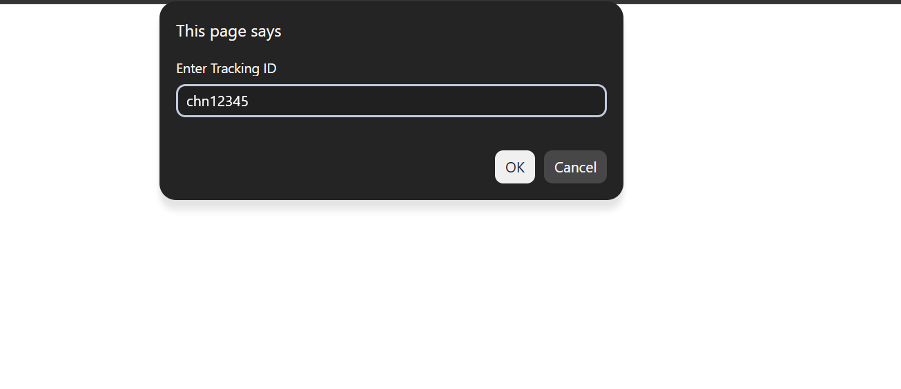
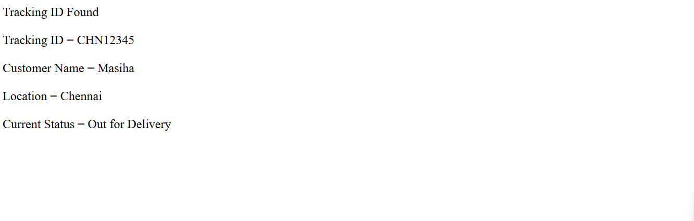

# Day 29 - JavaScript Courier Tracking System

## Overview

Created a simple Courier Tracking System using JavaScript to search and display courier details using a tracking ID.

The task focused on using JavaScript classes, constructors, objects, methods, string methods, conditional statements, and user input to build a basic courier tracking system.

## Topics Covered

- JavaScript Classes
- Constructor
- Objects
- Object Properties
- Class Methods
- Function Parameters
- Return Statement
- User Input
- `prompt()` Method
- Conditional Statements
- String Methods
- `toUpperCase()` Method
- Object Creation

## Technologies Used

- HTML5
- JavaScript

## Practice

Performed the following operations:

- Created a `Courier` class
- Created a constructor to store courier details
- Stored tracking ID, customer name, location, and delivery status
- Created a method to check the tracking ID
- Used `toUpperCase()` for case-insensitive tracking ID comparison
- Created a method to update the courier status
- Created a method to display courier details
- Took the tracking ID from the user using `prompt()`
- Checked whether the entered tracking ID exists
- Displayed courier details when the tracking ID was found
- Displayed an error message when the tracking ID was not found

## JavaScript Concepts Used

- `class`
- `constructor()`
- `new`
- `this`
- Methods
- Function parameters
- `return`
- `let`
- `prompt()`
- `if-else`
- `.toUpperCase()`
- Object properties
- Boolean values
- `document.write()`

## Output

## Learning Outcome

Learned how to create classes and objects in JavaScript, define methods, store and access object properties, compare strings without case sensitivity, and build a simple real-world courier tracking system.
