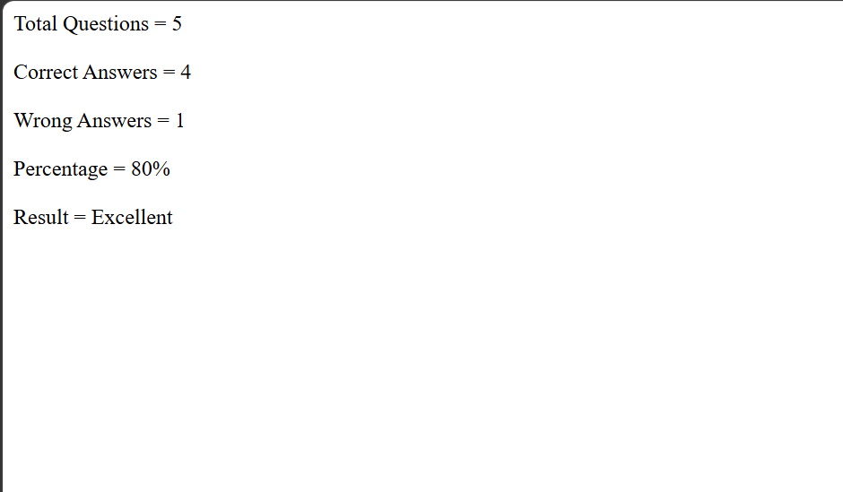

# Day 30 - JavaScript Quiz Score Analyzer

## Overview

Created a simple Quiz Score Analyzer using JavaScript to check answers, calculate the score and percentage, and display the performance result.

## Topics Covered

- JavaScript Classes
- Constructor and Objects
- Arrays
- `for` Loop
- String Methods
- Conditional Statements
- Score and Percentage Calculation

## Technologies Used

- HTML5
- JavaScript

## Practice

Performed the following operations:

- Created a `Quiz` class
- Stored questions and answers using arrays
- Compared answers using `toLowerCase()`
- Calculated correct and wrong answers
- Calculated the percentage
- Displayed the performance result based on the percentage

## JavaScript Concepts Used

- `class`
- `constructor()`
- `this`
- Arrays
- `.length`
- `for` loop
- `.toLowerCase()`
- `if-else`
- `return`
- `document.write()`

## Output

## Learning Outcome

Learned how to use JavaScript classes, arrays, loops, string methods, and conditional statements to build a simple quiz score analyzer.
