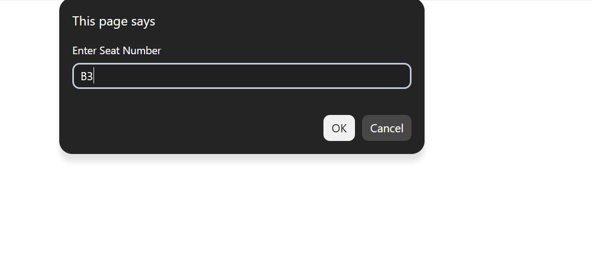
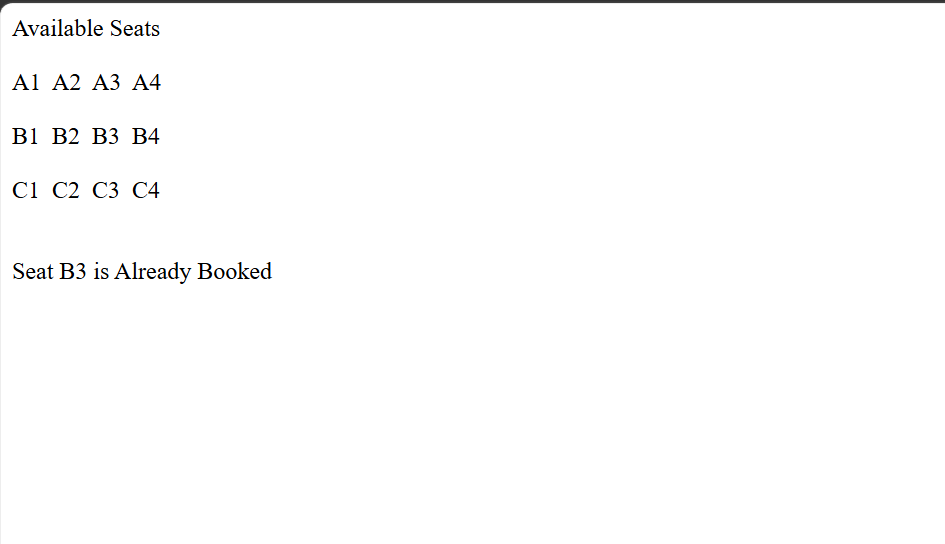

# Day 31 - JavaScript Seat Reservation System

## Overview

Created a simple Seat Reservation System using JavaScript to display seats and handle seat booking based on user input.

## Topics Covered

- JavaScript Classes
- Constructor and Objects
- Two-Dimensional Arrays
- Nested `for` Loops
- `includes()` Method
- `push()` Method
- String Methods
- Conditional Statements
- Seat Booking Logic

## Technologies Used

- HTML5
- JavaScript

## Practice

Performed the following operations:

- Created a `SeatBooking` class
- Stored seats using a two-dimensional array
- Stored already booked seats
- Displayed the seat layout
- Accepted a seat number from the user
- Checked whether the seat is valid
- Checked whether the seat is already booked
- Added newly booked seats to the booked array
- Displayed the booking result

## JavaScript Concepts Used

- `class`
- `constructor()`
- `this`
- Two-dimensional arrays
- Nested `for` loops
- `.length`
- `.toUpperCase()`
- `.includes()`
- `.push()`
- `if-else`
- `return`
- `prompt()`
- `document.write()`

## Output

## Learning Outcome

Learned how to use classes, two-dimensional arrays, nested loops, array methods, and conditional statements to create a basic seat reservation system.
