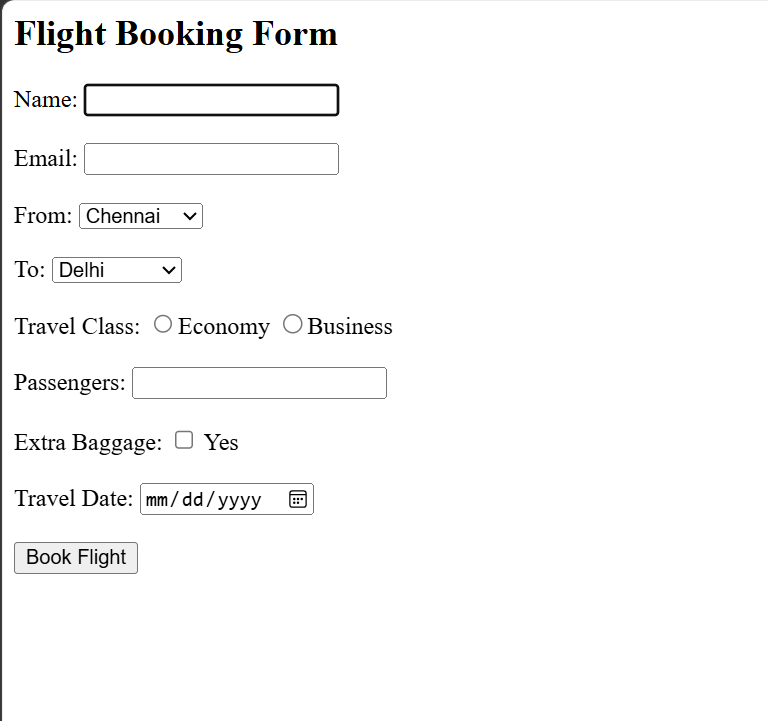

# Day 32 - JavaScript Flight Booking Form

## Overview

Created a simple Flight Booking Form using HTML and JavaScript to collect passenger details, calculate the fare, and display booking confirmation.

## Topics Covered

- HTML Forms
- JavaScript Classes
- Constructor and Objects
- Form Input Handling
- Radio Buttons
- Checkboxes
- Select Options
- DOM Manipulation
- Fare Calculation
- Conditional Statements

## Technologies Used

- HTML5
- JavaScript

## Practice

Performed the following operations:

- Created a flight booking form
- Collected passenger and travel details
- Used radio buttons for travel class
- Used checkbox for extra baggage
- Created a `Flight` class
- Calculated fare based on travel class and passengers
- Added extra baggage charges
- Validated required form details
- Displayed booking confirmation dynamically

## JavaScript Concepts Used

- `class`
- `constructor()`
- `this`
- Functions
- Objects
- `getElementById()`
- `getElementsByName()`
- `.value`
- `.checked`
- `Number()`
- `toUpperCase()`
- `if-else`
- `for` loop
- `innerHTML`
- Arithmetic operations

## Output

## Learning Outcome

Learned how to handle HTML form inputs with JavaScript, use classes and objects, perform fare calculations, validate user input, and dynamically display booking results.
