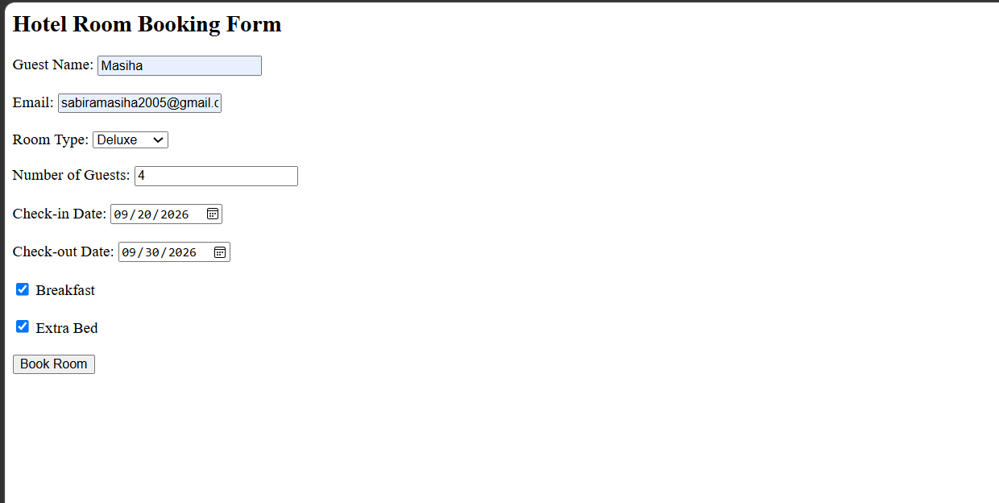

# Day 33 - JavaScript Hotel Room Booking

## Overview

Created a simple Hotel Room Booking System using HTML and JavaScript to collect guest details, calculate stay duration, and generate the total bill.

## Topics Covered

- HTML Forms
- JavaScript Classes
- Constructor and Objects
- Date Handling
- Form Input Handling
- Checkbox Handling
- Bill Calculation
- Conditional Statements
- DOM Manipulation

## Technologies Used

- HTML5
- JavaScript

## Practice

Performed the following operations:

- Created a hotel room booking form
- Collected guest and booking details
- Added Standard, Deluxe, and Suite room options
- Calculated number of stay days
- Added breakfast charges based on guests and days
- Added extra bed charges
- Validated booking details and dates
- Displayed booking confirmation and total amount

## JavaScript Concepts Used

- `class`
- `constructor()`
- `this`
- Functions
- Objects
- `Date()`
- Date difference calculation
- `getElementById()`
- `.value`
- `.checked`
- `Number()`
- `Math.floor()`
- `if-else`
- Arithmetic operations
- `innerHTML`
- `toUpperCase()`

## Output

## Learning Outcome

Learned how to work with HTML forms, JavaScript classes, date calculations, checkbox inputs, conditional logic, and dynamic bill generation.
