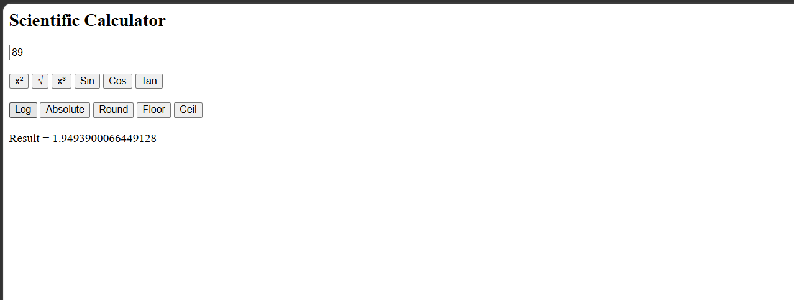

# Day 34 - JavaScript Scientific Calculator

## Overview

Created a simple Scientific Calculator using HTML and JavaScript to perform different mathematical operations using the JavaScript `Math` object.

## Topics Covered

- JavaScript Classes
- Constructor and Objects
- Functions
- Conditional Statements
- Math Methods
- DOM Manipulation
- User Input Handling
- Scientific Calculations

## Technologies Used

- HTML5
- JavaScript

## Practice

Performed the following operations:

- Calculated square and cube
- Calculated square root
- Calculated Sin, Cos, and Tan
- Calculated logarithm
- Calculated absolute value
- Performed Round, Floor, and Ceil operations
- Displayed the result dynamically

## JavaScript Concepts Used

- `class`
- `constructor()`
- `this`
- Functions
- Objects
- `Math.pow()`
- `Math.sqrt()`
- `Math.sin()`
- `Math.cos()`
- `Math.tan()`
- `Math.log10()`
- `Math.abs()`
- `Math.round()`
- `Math.floor()`
- `Math.ceil()`
- `Math.PI`
- `if-else`
- `getElementById()`
- `.value`
- `Number()`
- `innerHTML`

## Output

## Learning Outcome

Learned how to use JavaScript classes, functions, DOM manipulation, and built-in `Math` methods to create a functional scientific calculator.
