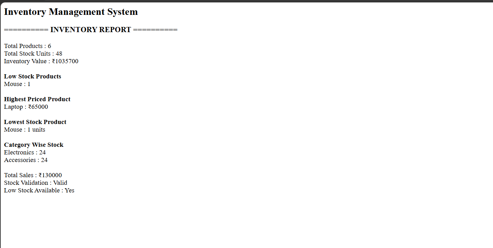

# Day 36 - JavaScript Inventory Management System

## Overview

Created an Inventory Management System using HTML and JavaScript to manage products, stock, sales, categories, and inventory reports.

## Topics Covered

- JavaScript Classes
- Objects and Arrays
- Array Methods
- Search and Filtering
- Stock Management
- Sales Management
- Inventory Calculations
- DOM Manipulation
- Template Literals

## Technologies Used

- HTML5
- JavaScript

## Practice

Performed the following operations:

- Searched products by name
- Filtered products by category
- Found low-stock products
- Added and removed stock
- Sold products and recorded sales
- Calculated total stock units
- Calculated total inventory value
- Calculated total sales
- Found highest-priced product
- Found product with lowest stock
- Retrieved product categories
- Calculated category-wise stock
- Validated stock values
- Generated an inventory report

## JavaScript Concepts Used

- `class`
- `constructor()`
- Objects
- Arrays
- `filter()`
- `find()`
- `map()`
- `reduce()`
- `sort()`
- `some()`
- `every()`
- `includes()`
- `toLowerCase()`
- `Set`
- Spread Operator
- Arrow Functions
- Template Literals
- `if-else`
- `for` loop
- `push()`
- `getElementById()`
- `innerHTML`
- `console.log()`

## Output

## Learning Outcome

Learned how to build a practical inventory management system using JavaScript classes, objects, array methods, stock operations, sales tracking, calculations, and dynamic report generation.
