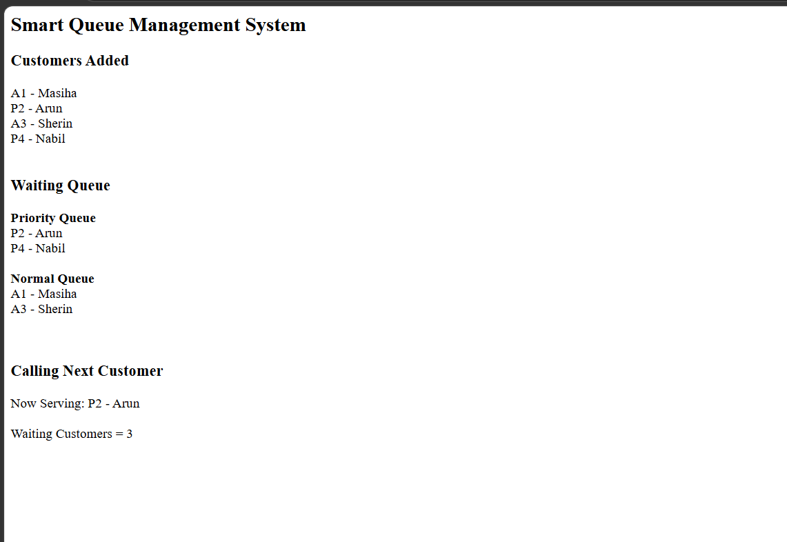

# Day 37 - JavaScript Smart Queue Management System

## Overview

Created a Smart Queue Management System using HTML and JavaScript to manage normal and priority customers using separate queues.

## Topics Covered

- JavaScript Classes
- Constructor and Objects
- Arrays
- Queue Management
- Priority Handling
- Token Generation
- Loops
- Conditional Statements
- DOM Manipulation

## Technologies Used

- HTML5
- JavaScript

## Practice

Performed the following operations:

- Added customers to the queue
- Generated unique tokens
- Created separate normal and priority queues
- Gave priority customers preference
- Called the next customer
- Displayed waiting customers
- Counted the number of waiting customers
- Displayed the current customer being served

## JavaScript Concepts Used

- `class`
- `constructor()`
- `this`
- Arrays
- `push()`
- `shift()`
- `if-else`
- `for` loop
- Object Literals
- Functions
- `getElementById()`
- `innerHTML`

## Output

## Learning Outcome

Learned how to implement a queue management system using JavaScript classes, arrays, priority handling, token generation, and queue operations.
