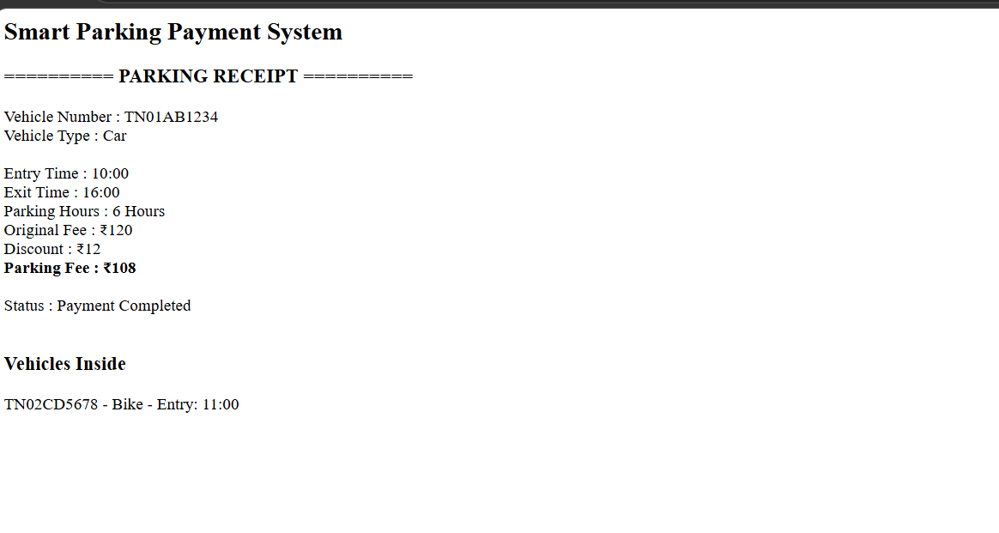

# Day 38 - JavaScript Smart Parking Payment System

## Overview

Created a Smart Parking Payment System using HTML and JavaScript to manage vehicle entry, exit, parking hours, parking fees, discounts, and payment receipts.

## Topics Covered

- JavaScript Classes
- Constructor and Objects
- Arrays
- Object Literals
- Vehicle Entry and Exit
- Parking Fee Calculation
- Discount Calculation
- Loops
- Conditional Statements
- Array Methods
- DOM Manipulation

## Technologies Used

- HTML5
- JavaScript

## Practice

Performed the following operations:

- Added vehicles to the parking area
- Checked duplicate vehicle entries
- Managed vehicle entry and exit
- Calculated parking hours
- Calculated parking fees based on vehicle type
- Applied discounts based on parking duration
- Removed vehicles after exit
- Displayed parking receipt
- Displayed vehicles currently inside

## JavaScript Concepts Used

- `class`
- `constructor()`
- `this`
- Arrays
- Object Literals
- `push()`
- `splice()`
- `for` loop
- `if-else`
- Template Literals
- `getElementById()`
- `innerHTML`

## Output

## Learning Outcome

Learned how to create a Smart Parking Payment System using JavaScript classes, arrays, loops, conditional statements, fee calculation, discount logic, and DOM manipulation.
