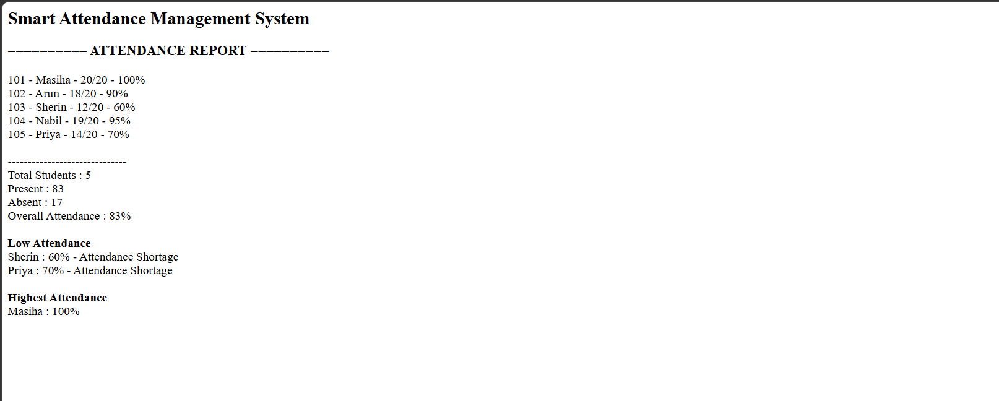

# Day 39 - JavaScript Smart Attendance Management System

## Overview

Created a Smart Attendance Management System using HTML and JavaScript to manage student attendance, calculate attendance percentage, track present and absent days, and identify students with low attendance.

## Topics Covered

- JavaScript Classes
- Constructor and Objects
- Arrays
- Object Literals
- Attendance Percentage
- Loops
- Conditional Statements
- DOM Manipulation

## Technologies Used

- HTML5
- JavaScript

## Practice

Performed the following operations:

- Stored student attendance details
- Displayed student attendance percentage
- Calculated total present days
- Calculated total absent days
- Identified students with attendance below 75%
- Generated an attendance report
- Displayed the report using DOM

## JavaScript Concepts Used

- `class`
- `constructor()`
- `this`
- Arrays
- Object Literals
- `for` loop
- `if` statement
- Functions
- `getElementById()`
- `innerHTML`

## Output

## Learning Outcome

Learned how to create an Attendance Management System using JavaScript classes, arrays, loops, conditional statements, percentage calculation, and DOM manipulation.
