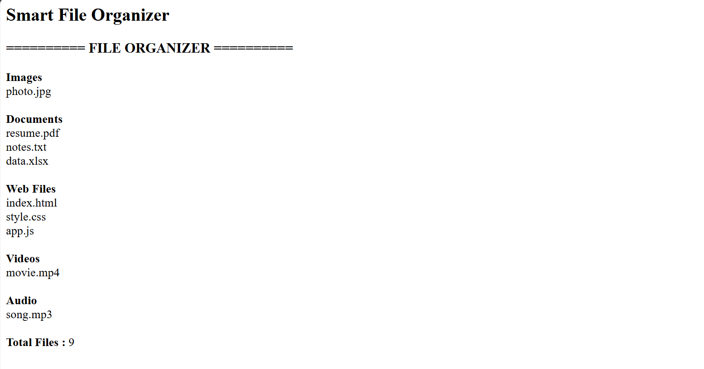

# Day 40 - JavaScript Smart File Organizer

## Overview

Created a Smart File Organizer using HTML and JavaScript to categorize files based on their file extensions.

## Topics Covered

- JavaScript Classes
- Constructor and Objects
- Arrays
- File Extension Handling
- Conditional Statements
- Loops
- String Methods
- DOM Manipulation

## Technologies Used

- HTML5
- JavaScript

## Practice

Performed the following operations:

- Stored different types of files
- Identified file extensions
- Categorized files into different groups
- Displayed Images, Documents, Web Files, Videos and Audio
- Counted the total number of files
- Displayed the organized file list

## JavaScript Concepts Used

- `class`
- `constructor()`
- `this`
- Arrays
- `split()`
- `pop()`
- `toLowerCase()`
- `if-else`
- `for` loop
- Functions
- `getElementById()`
- `innerHTML`

## Output

## Learning Outcome

Learned how to organize files based on their extensions using JavaScript classes, arrays, loops, string methods, and conditional statements.
