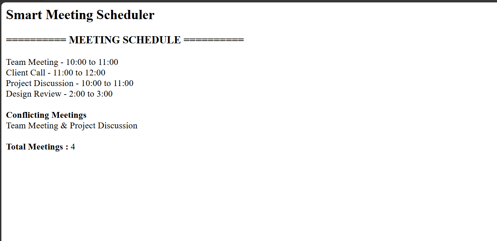

# Day 41 - JavaScript Smart Meeting Scheduler

## Overview

Created a Smart Meeting Scheduler using HTML and JavaScript to manage meetings and identify scheduling conflicts.

## Topics Covered

- JavaScript Classes
- Constructor and Objects
- Arrays
- Loops
- Conditional Statements
- Conflict Detection
- DOM Manipulation

## Technologies Used

- HTML5
- JavaScript

## Practice

Performed the following operations:

- Stored meeting details
- Displayed scheduled meetings
- Checked overlapping meetings
- Identified conflicting meetings
- Counted total meetings

## JavaScript Concepts Used

- `class`
- `constructor()`
- `this`
- Arrays
- `for` loop
- `if` statement
- Object Literals
- Functions
- `getElementById()`
- `innerHTML`

## Output

## Learning Outcome

Learned how to manage meeting schedules and detect overlapping meetings using JavaScript classes, arrays, loops, and conditional statements.
