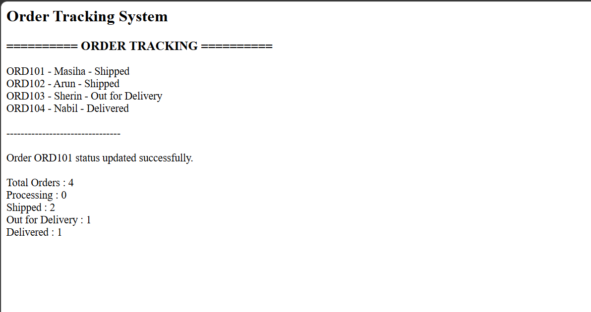

# Day 42 - JavaScript Order Tracking System

## Overview

Created an Order Tracking System using HTML and JavaScript to manage orders, update order status, and track the number of orders in each status.

## Topics Covered

- JavaScript Classes
- Constructor and Objects
- Arrays
- Loops
- Conditional Statements
- Order Status Management
- DOM Manipulation

## Technologies Used

- HTML5
- JavaScript

## Practice

Performed the following operations:

- Stored order details
- Displayed all orders
- Updated order status
- Counted orders by status
- Calculated total orders
- Displayed the order tracking report

## JavaScript Concepts Used

- `class`
- `constructor()`
- `this`
- Arrays
- `for` loop
- `if` statement
- Object Literals
- Functions
- `getElementById()`
- `innerHTML`

## Output

## Learning Outcome

Learned how to manage and track orders using JavaScript classes, arrays, loops, conditional statements, and DOM manipulation.
