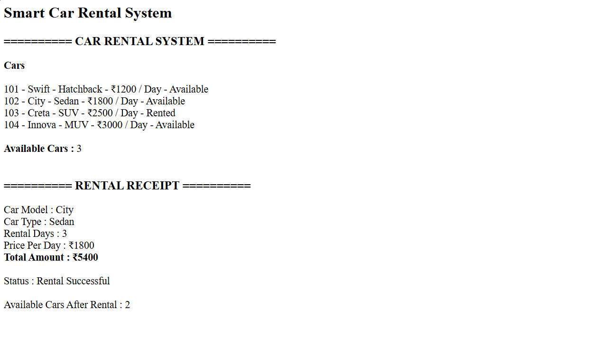

# Day 43 - JavaScript Smart Car Rental System

## Overview

Created a Smart Car Rental System using HTML and JavaScript to manage cars, rental availability, returns, and rental amount calculation.

## Topics Covered

- JavaScript Classes
- Constructor and Objects
- Arrays
- Loops
- Conditional Statements
- Car Rental Management
- DOM Manipulation

## Technologies Used

- HTML5
- JavaScript

## Practice

Performed the following operations:

- Stored car details
- Displayed all cars
- Checked car availability
- Searched cars by model
- Rented a car
- Calculated rental amount
- Returned a car
- Counted available cars

## JavaScript Concepts Used

- `class`
- `constructor()`
- `this`
- Arrays
- `for` loop
- `if-else`
- Object Literals
- Functions
- `toLowerCase()`
- `getElementById()`
- `innerHTML`

## Output

## Learning Outcome

Learned how to manage car rentals, availability, returns, and rental calculations using JavaScript classes, arrays, loops, conditional statements, and DOM manipulation.
