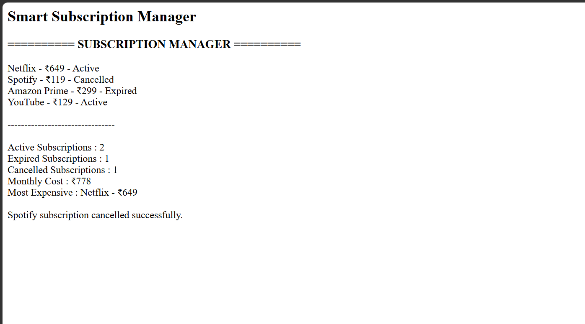

# Day 44 - JavaScript Smart Subscription Manager

## Overview

Created a Smart Subscription Manager using HTML and JavaScript to manage subscriptions, track their status, calculate monthly costs, and identify the most expensive subscription.

## Topics Covered

- JavaScript Classes
- Constructor and Objects
- Arrays
- Loops
- Conditional Statements
- Subscription Management
- Cost Calculation
- DOM Manipulation

## Technologies Used

- HTML5
- JavaScript

## Practice

Performed the following operations:

- Stored subscription details
- Displayed all subscriptions
- Counted active, expired, and cancelled subscriptions
- Calculated monthly subscription cost
- Found the most expensive subscription
- Cancelled a subscription
- Displayed the subscription report

## JavaScript Concepts Used

- `class`
- `constructor()`
- `this`
- Arrays
- `for` loop
- `if` statement
- Object Literals
- Functions
- `getElementById()`
- `innerHTML`

## Output

## Learning Outcome

Learned how to manage subscriptions, calculate monthly costs, track subscription status, and perform cancellation operations using JavaScript classes, arrays, loops, and conditional statements.
