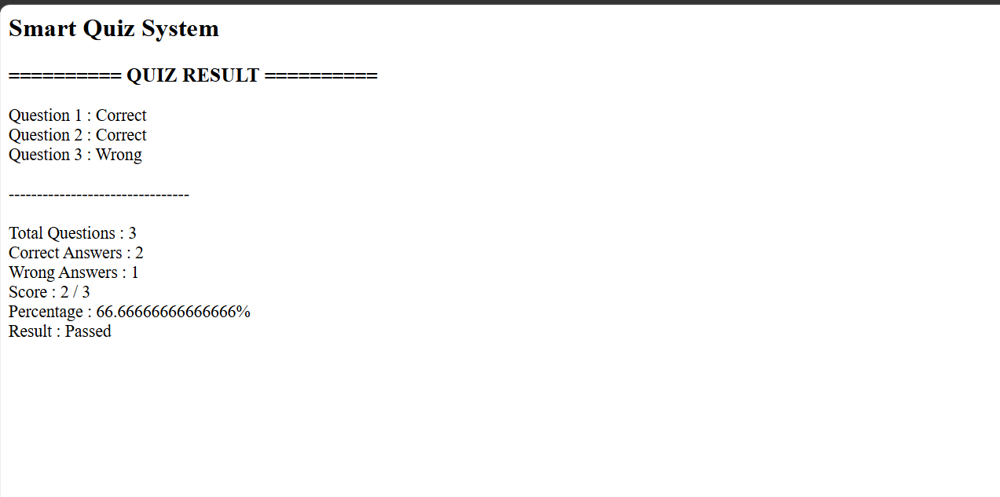

# Day 45 - JavaScript Smart Quiz System

## Overview

Created a Smart Quiz System using HTML and JavaScript to manage quiz questions, check answers, calculate scores, and display the final result.

## Topics Covered

- JavaScript Classes
- Constructor and Objects
- Arrays
- Loops
- Conditional Statements
- Quiz Management
- Score Calculation
- Percentage Calculation
- DOM Manipulation

## Technologies Used

- HTML5
- JavaScript

## Practice

Performed the following operations:

- Stored quiz questions and options
- Stored user answers
- Checked correct and wrong answers
- Calculated total score
- Calculated percentage
- Displayed quiz results
- Classified the result based on the score

## JavaScript Concepts Used

- `class`
- `constructor()`
- `this`
- Arrays
- `for` loop
- `if-else`
- Object Literals
- Functions
- `getElementById()`
- `innerHTML`

## Output

## Learning Outcome

Learned how to create a quiz evaluation system, check answers, calculate scores and percentages, and display results using JavaScript classes, arrays, loops, and conditional statements.
