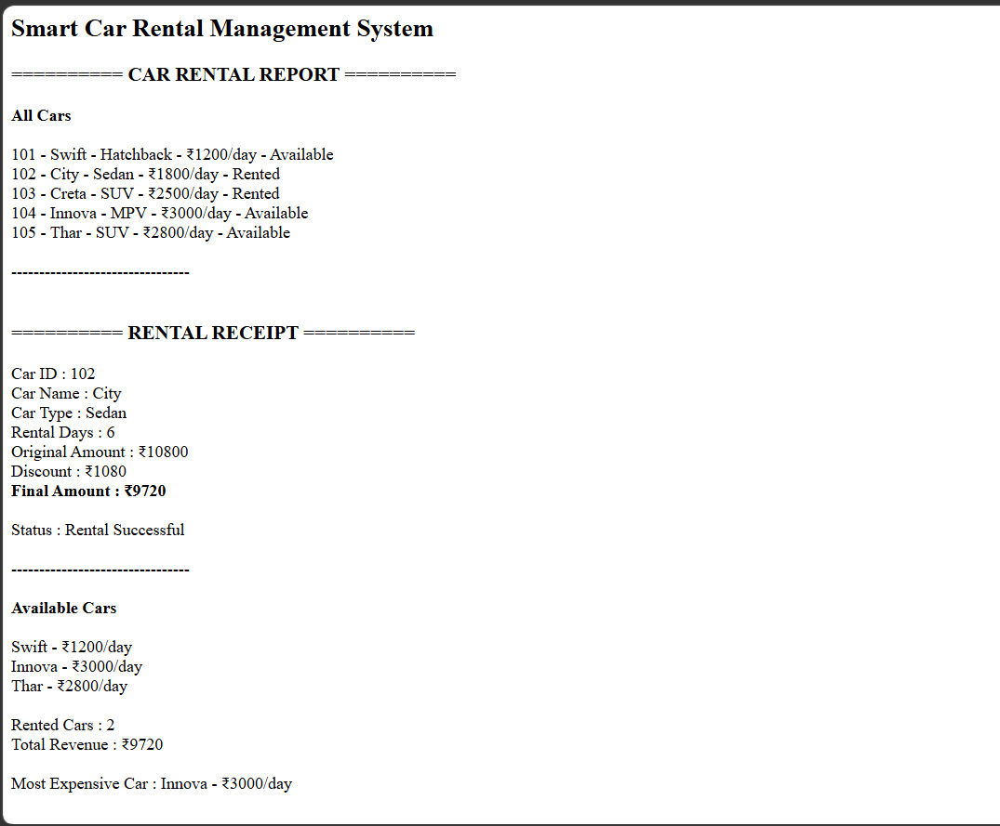

# Day 45 - JavaScript Smart Car Rental Management System

## Overview

Created a Smart Car Rental Management System using HTML and JavaScript to manage cars, handle rentals and returns, calculate rental charges, and track revenue.

## Topics Covered

- JavaScript Classes
- Constructor and Objects
- Arrays
- Loops
- Conditional Statements
- Car Rental Management
- Discount Calculation
- Revenue Calculation
- DOM Manipulation

## Technologies Used

- HTML5
- JavaScript

## Practice

Performed the following operations:

- Stored car details
- Displayed all cars
- Checked car availability
- Rented a car
- Calculated rental amount
- Applied rental discounts
- Returned a car
- Displayed available cars
- Counted rented cars
- Found the most expensive car
- Calculated total rental revenue

## JavaScript Concepts Used

- `class`
- `constructor()`
- `this`
- Arrays
- `for` loop
- `if-else`
- Object Literals
- Functions
- Template Literals
- `getElementById()`
- `innerHTML`

## Output

## Learning Outcome

Learned how to build a car rental management system using JavaScript classes, arrays, loops, conditional statements, calculations, and DOM manipulation.
